You can register for the de.NBI Cloud using an LifeScience account.
The registration is done via this [link](https://cloud.denbi.de/register).

### Step 1: Select your identity provider

First you have to select an identity provider where you have already an account:

!!! note
If you can not find your institution, you can as you see in the screenshot use a Google, LinkedIn or ORCID account.
If a project applicant is using a Google, LinkedIn or ORCID account further identity verification checks must be done
after the application is submitted.
You can also at any time connect your LifeScience account to as many other identity providers as you want through
your [LifeScience profile website](https://profile.aai.lifescience-ri.eu/profile/identities).

### Step 2: Register for an LifeScience account

In this example we will use the ORCID service. Once you press the ORCID button, you will be asked to log in with your
ORCID credentials.

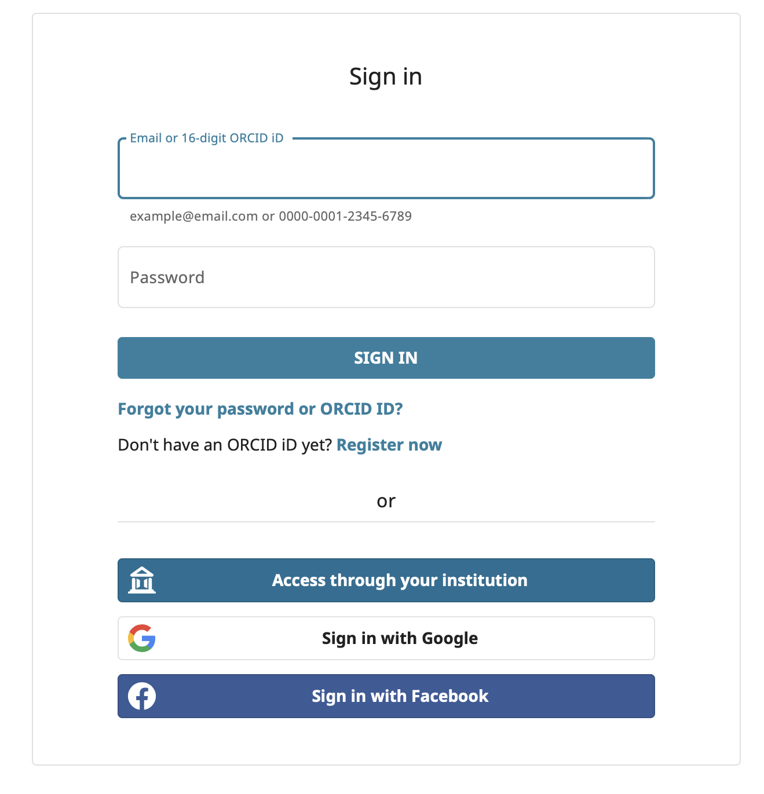

Then you will be asked to authorize that the LifeSciencesRI account can pull some information from your ORCID profile.

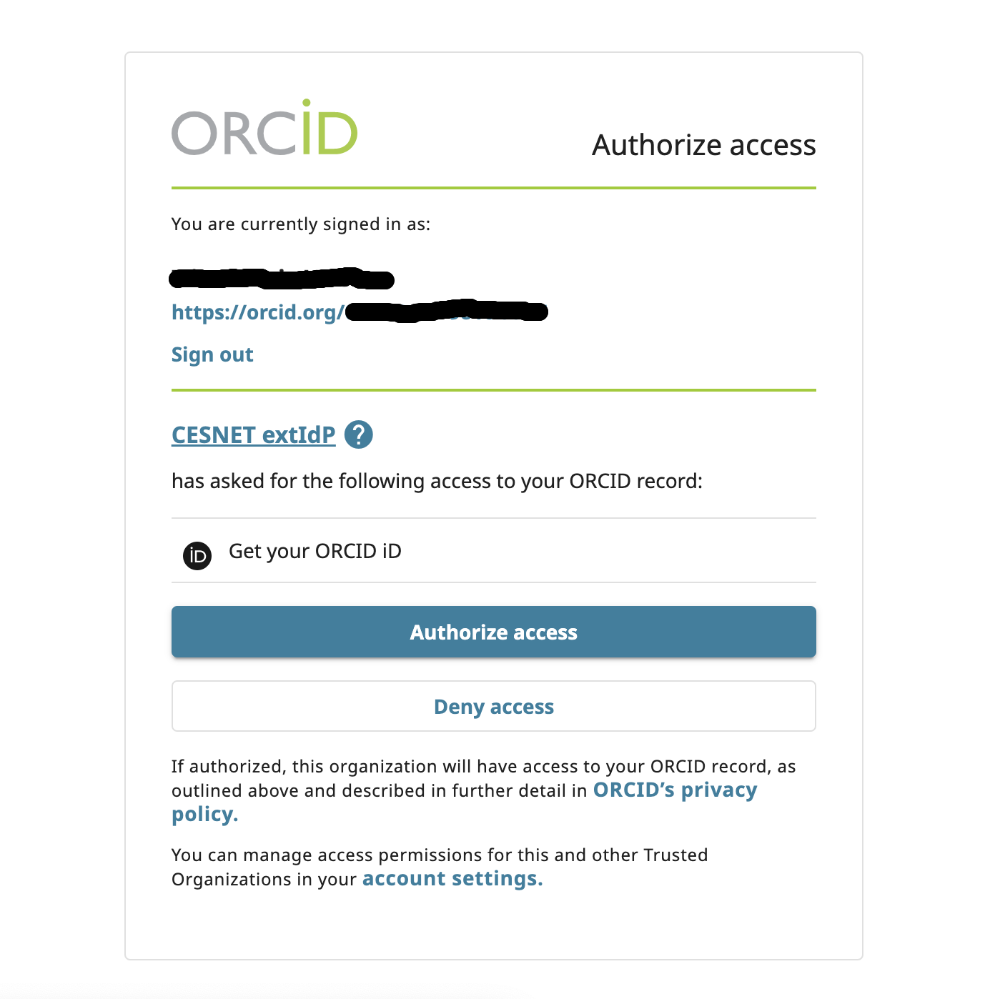

Once you've consented to linking of the accounts, you will be asked to specify your preferred name, email address and
username for the LifeSciencesRI account.

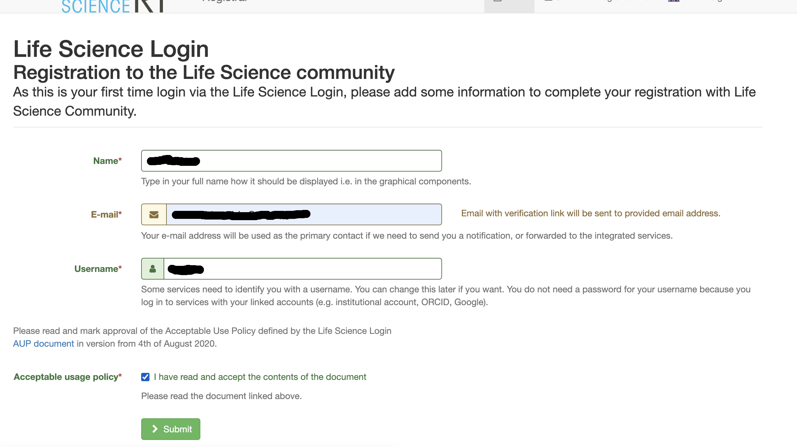

Once you submit, you will be sent a verification email.

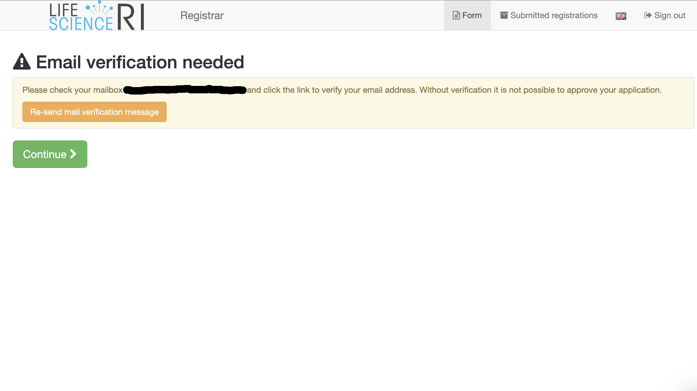

This should come within a few minutes,  __and make sure to check your spam folder__. The email should like as follows:

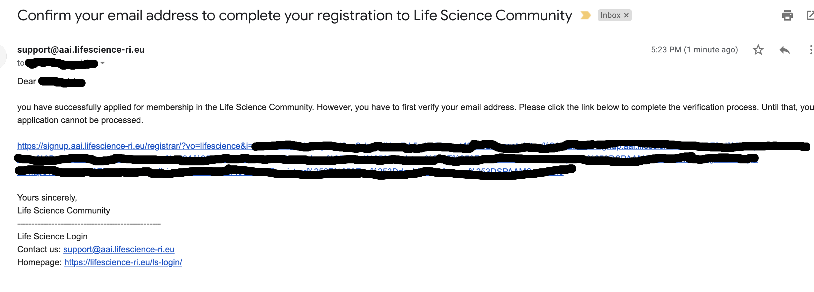

Once you click the link, you'll be sent back to the LifesciencesRI page, where you need to login with your preferred
provider to continue the next steps.

You will then see a confirmation that your emailed has been verified. Do not close this tab! Press the Continue button
and continue with this walkthrough

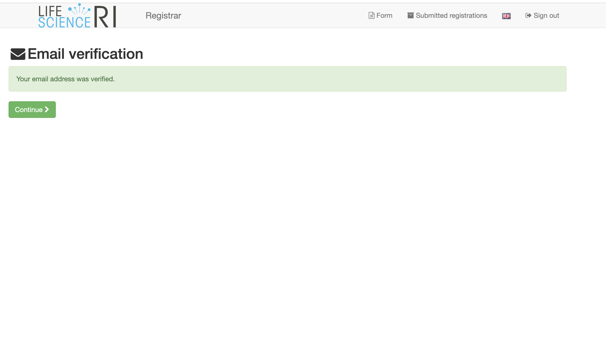

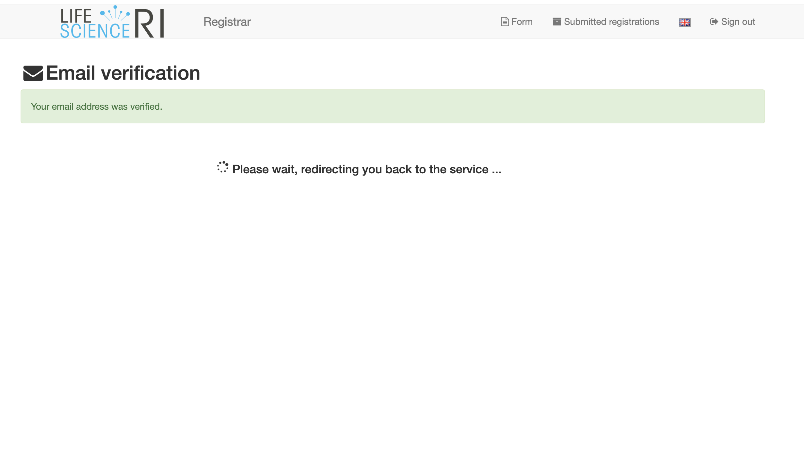
> **_NOTE:_** In the meantime you will also have recieved an email confirmation of the new LifeSciencesRI account which
> will look like:

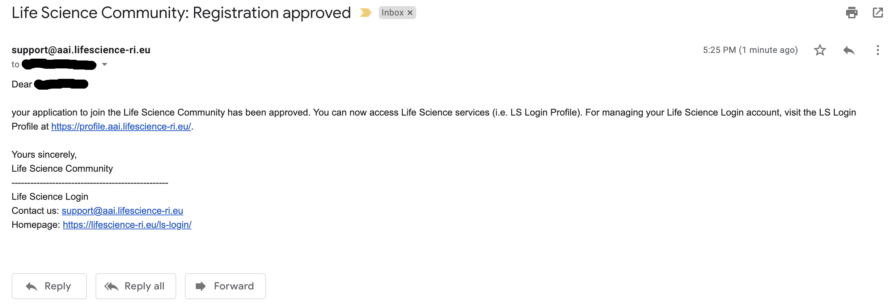

### Step 3: Registration for the de.NBI VO

Once you click on the `continue` button (above screenshot) you can also register for a de.NBI Cloud account:

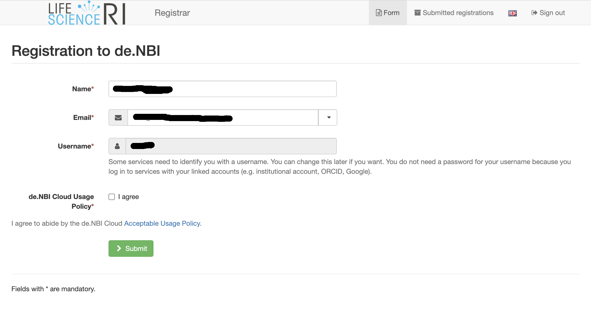

The data in the input-field should match with the data you have entered during the LifeScience registration process.
After submitting the form you are finally a member of the de.NBI Cloud:

After the registration you might want to [apply](../portal/allocation/) for a de.NBI Cloud project or you can be granted
access to an already existing Cloud project through
the [invitation function](../portal/project_overview/#member-management).

### Log into the de.NBI Portal

Check if you can access the deNBI cloud services by going to [https://cloud.denbi.de](https://cloud.denbi.de), and
press 'Login'

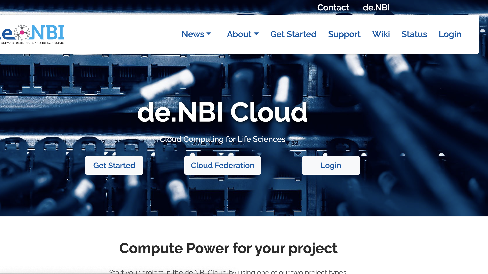

Select your login provider as performed above, and this time you will be asked to consent for deNBI to access your
LifeScience information.

We recommend selecting 'forever' for convienence, but this is not required.

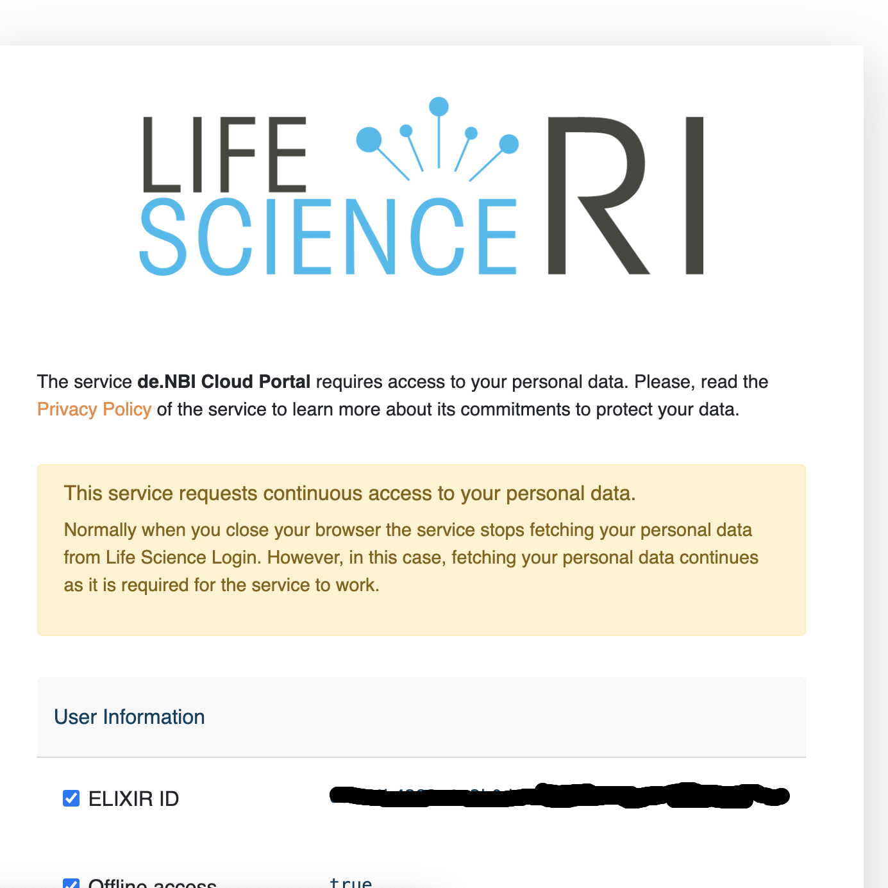

You should now receive another email where you must confirm the consent.

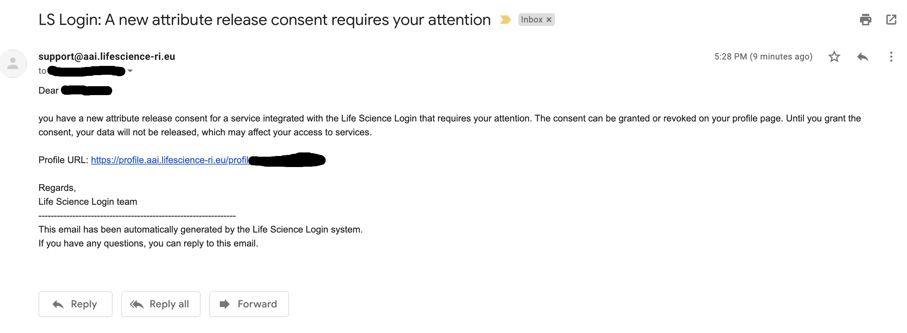