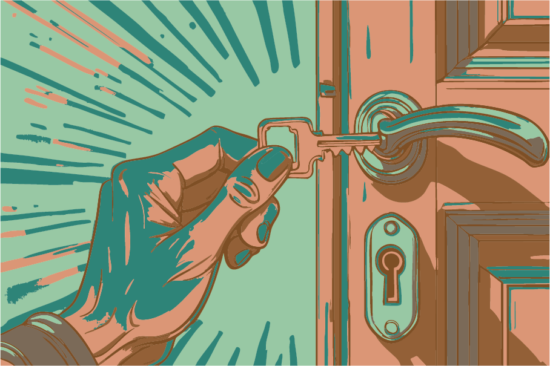
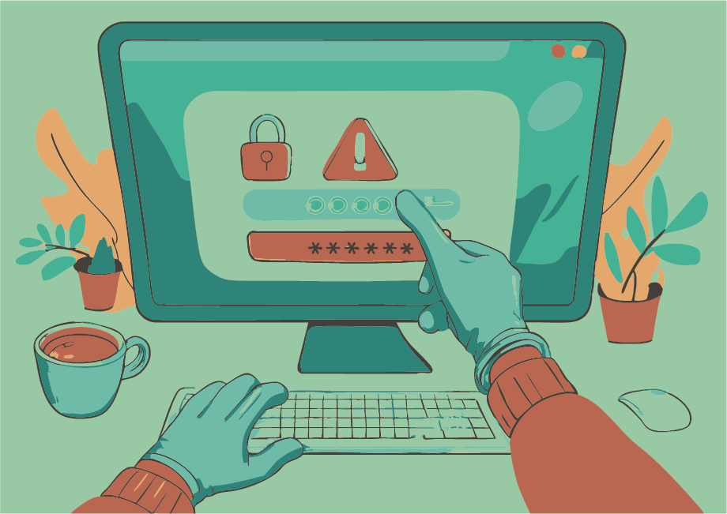
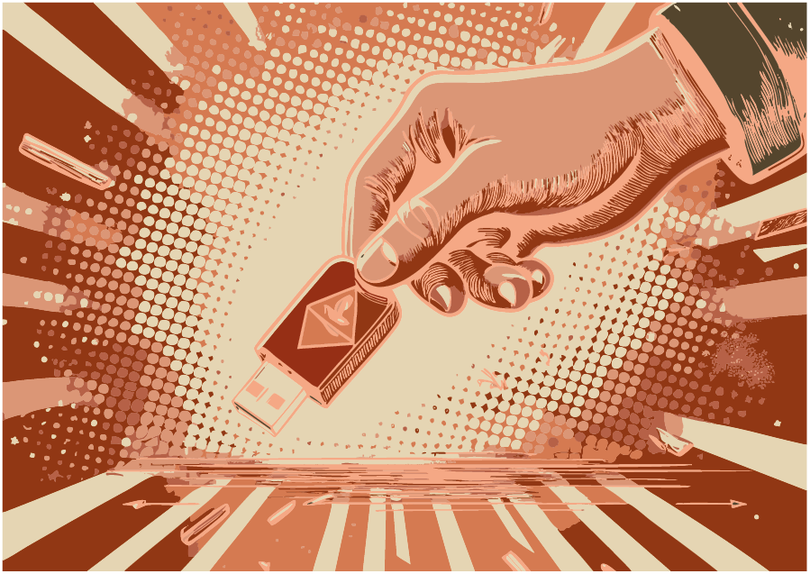
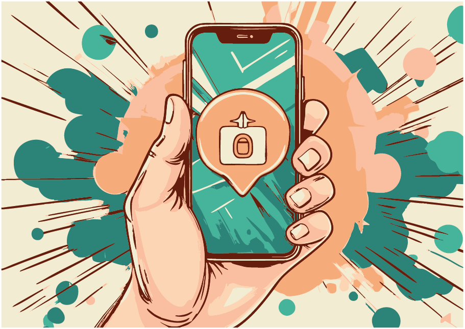

## Protecting Your Digital Workspace: Why Security Matters  

In today's interconnected world, workplaces rely heavily on digital technologies to store, process, and share sensitive information.
However, this increased reliance also introduces significant risks to data security and integrity.
Cyber threats, data breaches, and unauthorized access can compromise confidential business data,
disrupt operations, and damage an organization's reputation.
Effective security measures are essential to safeguard against these risks and ensure the confidentiality,
availability, and integrity of digital assets in daily work environments.
We want to highlight the importance of implementing robust security measures, to maintain a secure digital environment.
The following is a list of some generally useful safety precautions.

### Locking Your Office Door: A Simple yet Effective Security Measure



Leaving your office door unlocked may seem like a minor oversight, but it can have significant consequences for the security of your company or research institute.
An unsecured workspace can give unauthorised people access to sensitive information, confidential documents and valuable equipment.
This can lead to data breaches, intellectual property theft or even sabotage.
Locking your office door when you leave is a simple but effective way to protect your workplace from potential threats.
It prevents opportunisticc intruders from entering your workspace and ensures that only authorised personnel have access to sensitive areas.
Make it a habit to lock your door every time you leave your office to contribute to the overall security of your organisation.

### Locking Your Screen: Protecting Sensitive Information from Unintended Eyes



Leaving your computer unattended with an unlocked screen can be just as risky as leaving your office door open.
An unsecured workstation can give unauthorised people access to sensitive information, confidential documents and restricted systems.
This can lead to data breaches, intellectual property theft or even identity theft.
By locking your screen when you leave your desk, you can ensure that only authorised personnel have access to the information on your computer.
In addition, many organisations require regular screen locking as part of their security policy to comply with regulatory requirements and industry standards.
Make it a habit to lock your screen every time you leave your workstation to protect sensitive information and contribute to the overall security of your organisation.

### The Hidden Dangers of Found USB Drives



USB drives are convenient and portable, but they can also be a hidden threat to your organisation's security.
Inserting an unknown or found USB drive into your computer can expose your system to malware, viruses and other types of cyber threats.
These malicious devices, often referred to as "poisoned" USB drives, can compromise the security of your computer and potentially spread throughout your network.
By plugging in a suspicious USB drive, you may inadvertently introduce ransomware, Trojans or spyware that can steal sensitive information, disrupt operations or even take control of your system.
It is important to exercise extreme caution when dealing with unfamiliar USB drives. Never connect a found or untrusted USB device to your work computer or other company-owned equipment.
Instead, hand it over to IT security personnel for proper analysis and disposal. Remember, the risk is not worth the reward - it's better to be safe than sorry!

### The Risk of Unsecured Wi-Fi Networks


Public Wi-Fi networks can be convenient for staying connected on-the-go, but they often come with significant security risks. 
When you use an unknown or unsecured Wi-Fi network, you may be exposing your device and sensitive information to cyber threats. 
Hackers can easily intercept data transmitted over public Wi-Fi networks, including passwords, credit card numbers, and confidential business information. 
Additionally, malicious actors can set up fake hotspots that mimic legitimate networks, tricking users into connecting and compromising their devices. 
To protect yourself and your organization's data, avoid using unsecured Wi-Fi networks for work-related activities or accessing sensitive information. Instead, consider the following options: 

- Use a virtual private network (VPN) to encrypt your internet traffic
- Connect to a secure, password-protected network
- Use your mobile device's cellular connection instead of public Wi-Fi
- Wait until you are connected to a trusted network before accessing sensitive information
     
### The Dangers of Improper Document Disposal


Sensitive documents containing confidential information, such as employee records,
financial records and proprietary business or research information, require special handling when it comes to disposal.
Throwing these documents in the regular paper bin can pose a significant risk to the security and confidentiality of your organisation.
Unauthorised individuals may intentionally or unintentionally rifle through the trash and access sensitive information that could be used for malicious purposes.
This is often referred to as "dumpster diving". To protect your organisation's confidential information, it is essential to implement proper document disposal procedures.
Consider using:

- Secure shredding bins
- Document destruction services that provide certification of destruction

When not in use, sensitive documents should be kept secure to prevent them from being accessed by unauthorized individuals.

### General Measures and Awareness



As we rely more heavily on digital technologies to communicate and conduct business and research,
it's essential to be aware of the potential risks and take steps to protect ourselves.
Here are some general measures and best practices to help you stay safe online: 

- Be cautious with emails : Be wary of phishing emails that try to trick you into revealing sensitive information or clicking on malicious links. Verify the sender's identity and check for spelling mistakes, grammatical errors, and suspicious attachments.
- Use strong passwords : Choose unique and complex passwords for each account, and avoid using easily guessable information such as your name or birthdate. Consider using a password manager to generate and store secure passwords.
- Enable second-factor authentication (2FA) : Add an extra layer of security by requiring a second form of verification, such as a code sent to your phone or a biometric scan, in addition to your password.
- Keep software up-to-date : Regularly update your operating system, browser, and other software to ensure you have the latest security patches and features.

## Security aspects of cloud computing

### Shift in responsibility

One important change triggered by the rise of cloud computing is a shift in responsibility.
In the pre-cloud world, a system administrator was responsible for taking care of the system,
installing security patches and fixes, securing the network, setting up firewalls and monitoring
the operation state of servers.

With cloud computing, this has changed considerably:
The system administrator is still responsible for the bare
hardware servers. However, the user-created instances (virtual machines) running on these servers
are the sole responsibility of the user who launched them. This includes any activity going on
inside the instances while they are running as well as all of their
communication with the outside world.

Large compute ressources and unrestricted high-speed internet access make cloud instances
an attractive target for outside attackers. Users are obligated to keep their instances
secure and up-to-date.

### General cloud related security recommendations

- SSH access: Always use key based authentication instead of a plain password.

- Keep the operating system and all installed packages of your instances up to date.

- Make sure to always use the most recent of the officially provided cloud images when
  launching a new instance.

- Configure the internal firewall of your instances using `iptables` to add another layer of
  security in addition to the security groups.

- Do not rely on any global cloud site firewall, its configuration might change without
  prior notice. If in doubt, ask the site administrators!

If you have detected a possible security problem with an instance, please contact the site
administrators immediately and ask for support. They will to advise you on how to proceed.

### Best practices for remote port access

#### SSH port forwarding

SSH is able to forward a port through a tunnel and make it available to your local computer only.
No security group rule needed! So e.g. to access a server listening on port `localhost:8080` of your
instance, you forward it to `127.0.0.1:8080` on your local computer by adding the following to your
SSH call: `-L 127.0.0.1:8080:localhost:8080`. A server serving a website would then be available at
`http://127.0.0.1:8080`.

Further information:

- [http://help.ubuntu.com/community/SSH/OpenSSH/PortForwarding](http://help.ubuntu.com/community/SSH/OpenSSH/PortForwarding)

#### Well defined remote IP range

Allow access from only a subset of IP addresses, e.g. limit this to your institution's IP address range.
For Bielefeld University this would be `129.70.0.0/16`, which amounts to only 0.002% of the world's IPv4 addresses, thereby drastically reducing the attack surface.

##### Determine your institution's IP address range and convert it to CIDR notation

1. Use the [european internet registry search](https://apps.db.ripe.net) to find the IP address range for your institution.
   
   - Search for your institution first, e.g. `Universitaet Bielefeld` and find the `organisation:` ID (e.g. `ORG-UB29-RIPE`).
   
   - Now search again, but this time for the ID, after selecting `Inverse lookup` and checking the box next to `org`.
   
   - Look for the line `inetnum:` containing your institution's IP address range, e.g.
     ```
     inetnum:         129.70.0.0 - 129.70.255.255
     ```
   
2. Transform the IP address range into CIDR notation using a [calculator](https://www.subnet-calculator.com/cidr.php).

   - Enter the start of the range into the field `IP Address`.
   - Adjust the `Mask Bits` (`16` is a good starting point) until the end of your institution's IP range matches (or is included in) the range shown in the field `CIDR Address Range`.
   
3. Use the `Net: CIDR Notation` from the calculator to configure the _Remote CIDR_ of your security group rule (e.g. `129.70.0.0/16`).

The `default` security group (which all new instances get) should not be touched. Create a new one instead, add your rules and attach it only to the instances you need outside access to.

Further information:

- [https://en.wikipedia.org/wiki/Regional_Internet_registry](https://en.wikipedia.org/wiki/Regional_Internet_registry)
- [https://en.wikipedia.org/wiki/Classless_Inter-Domain_Routing#CIDR_notation](https://en.wikipedia.org/wiki/Classless_Inter-Domain_Routing#CIDR_notation)

#### Application security

Many applications support authentication (e.g. username and password). Use it to stop any outside
attacks that were (easily) able to guess your instance's IP and port (which are not secret by any
means). It is also highly recommended to protect your network traffic from prying eyes using TLS
which is available inside almost all server applications, especially webservers.

Feel free to take a look at the tutorial [Secure hosting of a public Web Server](Tutorials/PublicWebServer/index.md) for guidance.

**Always** change the default credentials of services as these are well known and
will be probed as soon as the service is exposed to the internet.
