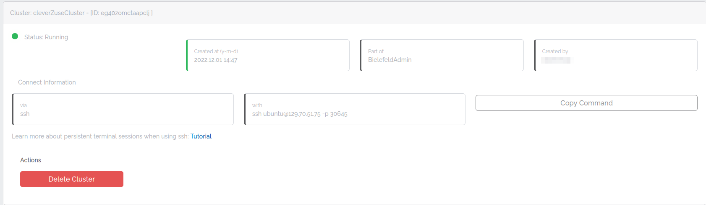
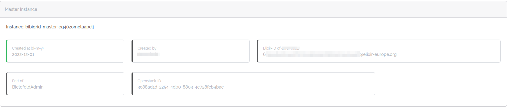
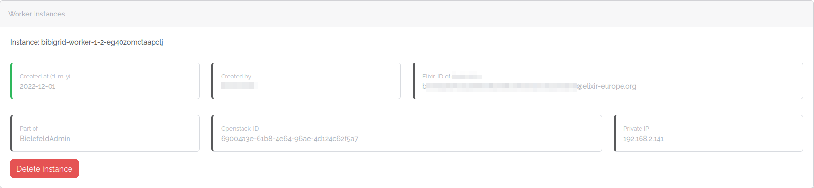

# Cluster detail

The detail page of your cluster offers more information about your cluster and its nodes.

## General information and actions

The general information part shows you:

- The name of your cluster.
- The general status of your cluster. The status mainly depends on the status of your master node.
- Who created your cluster and when.
- Which project your cluster belongs to.
- How you can connect to your cluster. The information differs depending on your configuration.

Further, you can take the following actions:

- Delete your cluster by clicking `Delete Cluster`.

## Master node

The master node part shows you:

- The name of your master node.
- Who created your master node and when.
- Which project your master node belongs to.
- The Elixir ID of the node creator.
- The OpenStack ID of your master node

You can't delete your master node.

## Worker nodes

The worker nodes part shows you:

- The worker batches.
- The worker node names.
- Who created the worker node and when.
- Which project your worker node belongs to.
- The Elixir ID of the node creator.
- The OpenStack ID of each worker node.

Further, you can take the following actions on each worker node:

- Delete a worker node by clicking `Delete instance`.
