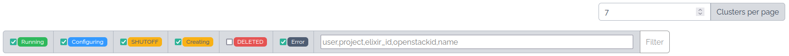
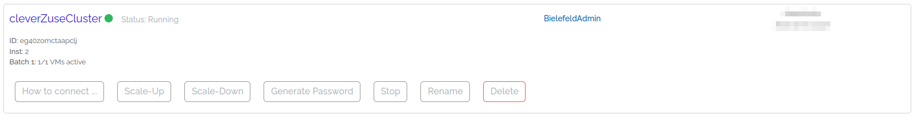
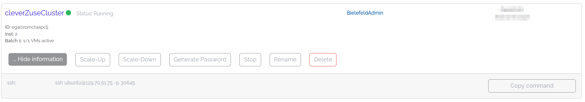
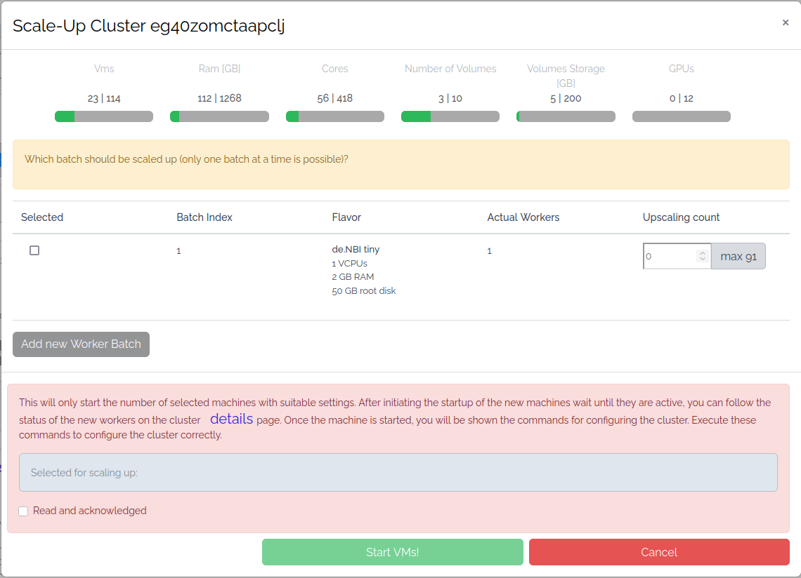
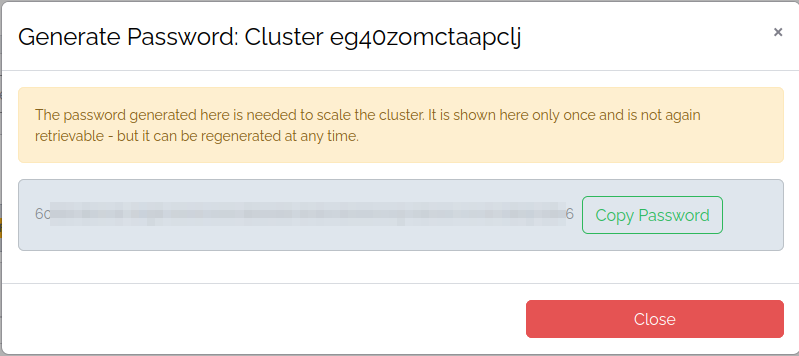
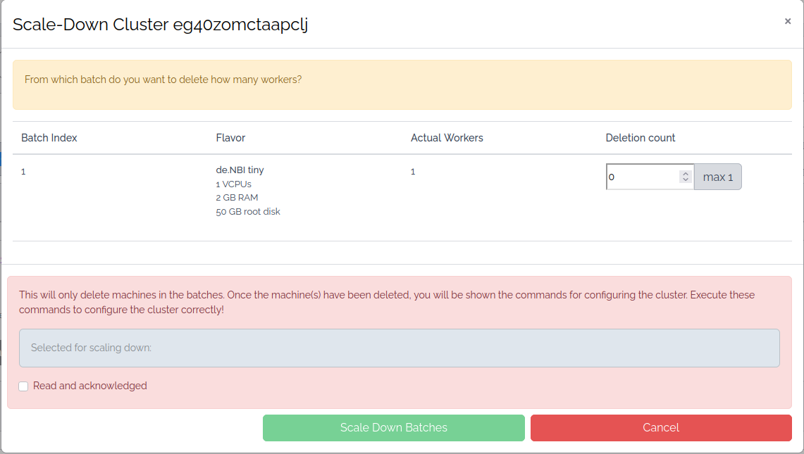
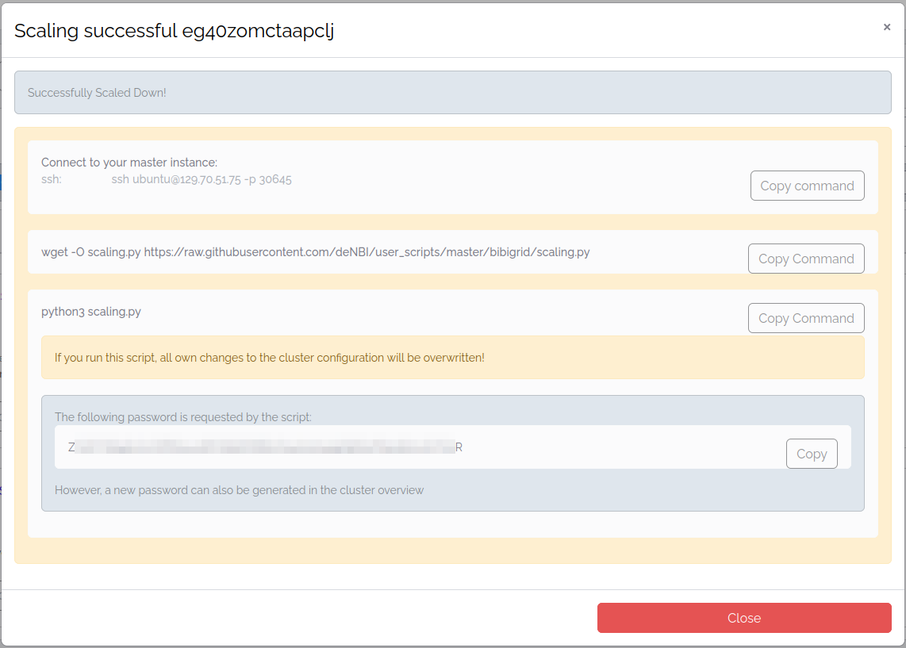
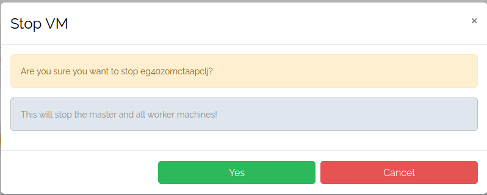
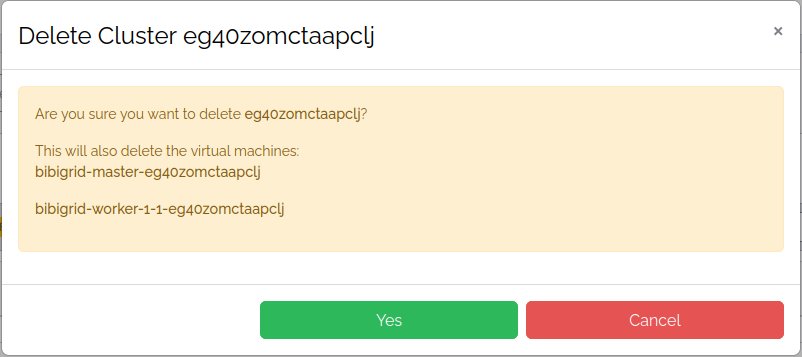

# Cluster overview

On the `Cluster Overview` you can list clusters, get more information, and manage them.

## Filter and pagination



You can filter all clusters:

- By checked status
- By name of the cluster owner
- By project name
- By Elixir ID of the cluster owner
- By cluster name

Click `Filter`.<br>
You can set how many clusters you want to see on a page and scroll through the pages.

## Cluster information card



See the name, the status, the project, and the creator of the cluster.<br>
Click on the name to get to the [Detail page](cluster_detail.md). Click on the project name to get
to the [Project overview](../../portal/project_overview.md).

## How to connect



Click `How to connect`.
A list with connection information opens depending on your cluster configuration.<br>

???+ info "SSH"
    The SSH command tells you how to connect to your master node.

## Scale-Up your cluster

To expand your cluster and add more workers, click `Scale-up`.



A modal opens where you can specify the batch you want to expand or add a new worker batch.
Click `Add new Worker Batch` to add a new worker batch where you can specify the flavor, and the worker number.
<br>
<br>
**This process only starts the worker nodes. You have to configure your cluster before your cluster
can use the new worker nodes.**

???+ fail "Wait until active before configuring"
    You have to wait until your worker nodes have the active status
    before you continue to configure your cluster.

###  Configure your cluster

Your have to reconfigure your master node to use the new worker nodes.
A modal opens after starting your new worker nodes, which shows you the necessary steps.


Connect to your master instance with SSH.<br>
Download the scaling script:

```BASH
wget -O scaling.py https://raw.githubusercontent.com/deNBI/user_scripts/master/bibigrid/scaling.py
```

Run the scaling script:

```BASH
python3 scaling.py 
```

The scaling script requests a password.
If you already closed the modal or have no access to the password shown in the modal, 
you can generate a new password.<br>
Click `Generate Password` at the bottom of the cluster information card. A modal opens with a
new generated password.



You can use the new workers after you ran the script.<br>
You can test with the command `sinfo` if the script added your workers correctly.

**If the new worker is still missing, you can try to restart slurm:**

```BASH
sudo /etc/init.d/slurmctld restart
```

???+ question "Your worker is still missing"
    If your worker is still missing after you ran the command, something went wrong.
    Contact the support at [cloud-helpdesk@denbi.de](mailto:cloud-helpdesk@denbi.de).

## Scale-Down your cluster

To reduce your cluster and remove workers, click `Scale-Down`.



A modal opens where you can select the batches you want to reduce, and the number of workers
you want to remove.
<br>
<br>
**This process only removes the worker nodes. You have to configure your cluster before your cluster
recognizes the removed worker nodes.**

???+ fail "Wait until deleted before configuring"
    You have to wait until your worker nodes have the deleted status
    before you continue to configure your cluster.

###  Configure your cluster

Your have to reconfigure your master node to recognize the removed worker nodes.
A modal opens after removing the worker nodes, which shows you the necessary steps.



Connect to your master instance with SSH.<br>
Download the scaling script:

```BASH
wget -O scaling.py https://raw.githubusercontent.com/deNBI/user_scripts/master/bibigrid/scaling.py
```

Run the scaling script:

```BASH
python3 scaling.py 
```

The scaling script requests a password.
If you already closed the modal or have no access to the password shown in the modal,
you can generate a new password.<br>
Click `Generate Password` at the bottom of the cluster information card. A modal opens with a
new generated password.


You can test with the command `sinfo` if the script removed your workers correctly.

**If your workers aren't removed, you can try to restart slurm:**

```BASH
sudo /etc/init.d/slurmctld restart
```

???+ question "Your workers aren't removed"
    If your workers aren't removed after you ran the command, something went wrong.
    Contact the support at [cloud-helpdesk@denbi.de](mailto:cloud-helpdesk@denbi.de).

## Stop your cluster

To stop your cluster, click `Stop`. A modal opens, asking you to confirm your action.



## Delete your cluster

To delete your cluster, click `Delete`. A modal opens, asking you to confirm your action.



If you have volumes attached to a node of your cluster, they get detached but not deleted.
