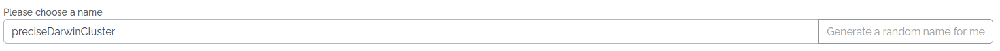
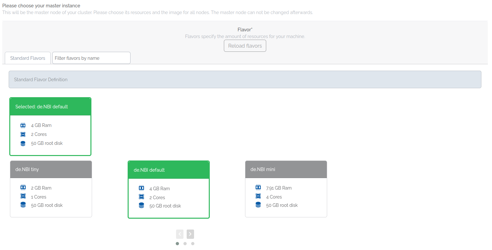
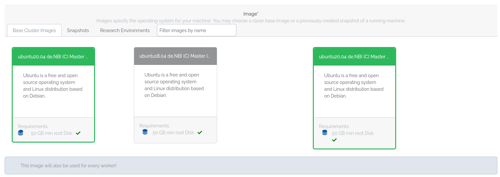
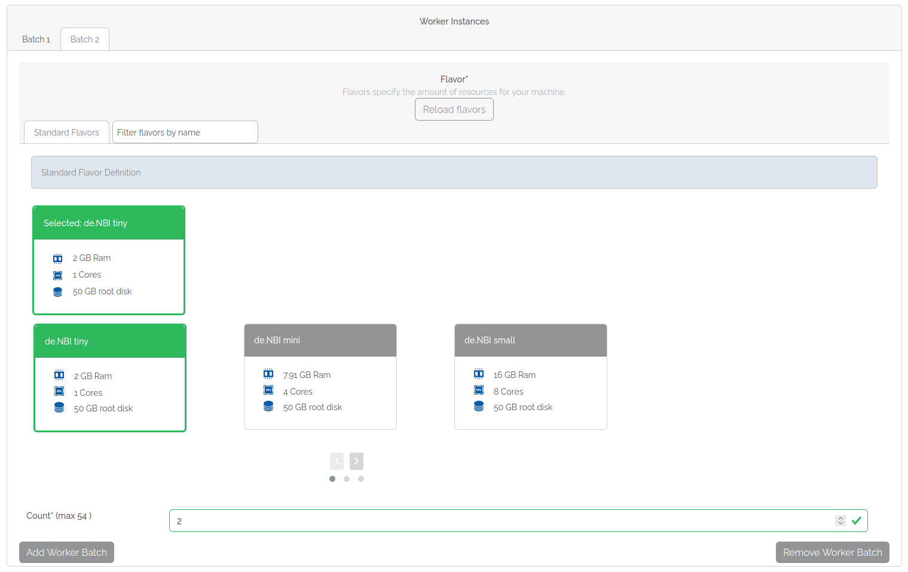

# Start a new cluster

To start a cluster, you need to belong to a SimpleVM project with activated cluster feature.
If you can't see the “New Cluster” button in the sidebar on the left, you either need to reload the page,
or you don't belong to a SimpleVM project.

A message informs you if you can't start a cluster. This can happen if:

- You haven't enough resources:
    - Delete running virtual machines or clusters to free resources.
    - An administrator of your project can request more resources.
      See the [Modification request](../../portal/modification.md) wiki page for more information.
- Members of your project may not launch virtual machines:
    - Ask an administrator of your project to start a cluster for you.
    - Ask an administrator of your project to change the appropriate setting.

## Resource overview

This line shows the resources used in your project, and the resources available. 
If you can't start a new cluster because you haven't enough resources, have an administrator of your
project request more resources.

## Name your cluster

Name your cluster here or generate a random name.
If the name already exists, a unique ID appends to the name after starting your cluster.

## Select a master flavor

Choose the flavor of your master node.
Click on a tab to switch between flavor types or use the filter to search by name.
A flavor sets the resources of your virtual machine. 
See the [Flavor](../../Concept/flavors.md) wiki page for more information about flavors.

### About ephemeral flavors

Ephemeral flavors offer extra disk space.
That extra disk space mounts to the virtual machine when it starts and offers faster access than a volume. 
Contrary to a volume, data on an ephemeral don't remain when you delete your virtual machine.
Data on an ephemeral remain when you reboot or pause your vm.
Further, snapshotting a vm doesn't persist data from an ephemeral. 
Therefore, you should use ephemeral storage for temporary data that often changes
(e.g. cache, buffers, or session data) or data often replicated across your environment.
If you need to persist data from an ephemeral, create a backup on a volume.
See the [Best practices for data backup](../backup.md) wiki page for more information.

???+ danger "Backup important data from an ephemeral"
    Ephemeral storage is a fleeting storage.
    All data will be irretrievably lost when you delete your vm.
    If you need to persist data from an ephemeral, create a backup on a volume.
    See the [Best practices for data backup](../backup.md) wiki page for more information.

## Select an image

Choose the image all your nodes start with.
An image includes the operating system and tool packages installed on your vm. 
You may choose between base images provided by de.NBI, pre-build images containing a Research Environment
provided by de.NBI, or one of your snapshots.
Click on a tab to switch between them or use the filter to search by name. 
For more information about images and snapshots, see [Images and snapshots](../snapshots.md).

???+ info "Worker node image"
    All your worker nodes start with the same image you choose for your master node.

## Configure your worker batches

A worker batch bundles all worker nodes of the same flavor.
Each worker batch has its own number.
You can have as many batches as you have resources and flavors available. 
Click the batches tab to switch between batches.

### Select flavor and count for a worker batch

Select the flavor for a worker batch and set the count of wanted workers.
Depending on how many resources you have available in your project, and the master and worker flavor 
you selected, you can start a limited worker count for the batch.

### Add a worker batch

Click `Add Worker Batch` to add a new worker batch.
The new numbered batch appears in the tab. 
Select the flavor and worker count for this batch.

### Remove a worker batch

Click `Remove Worker Batch` to remove the selected worker batch from your cluster configuration.

## Start your cluster

Read and confirm the acknowledgments and start your cluster. 
After a short time, the page redirects you to the [Cluster Overview](./cluster_overview.md) page.
