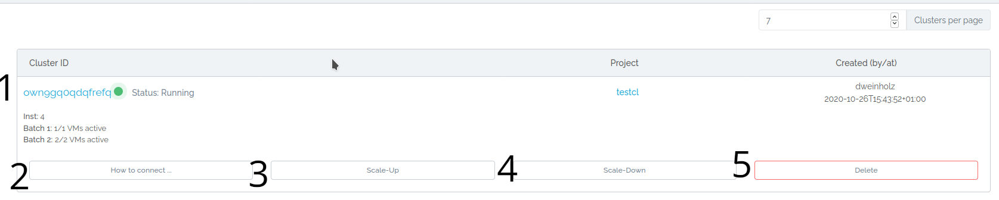
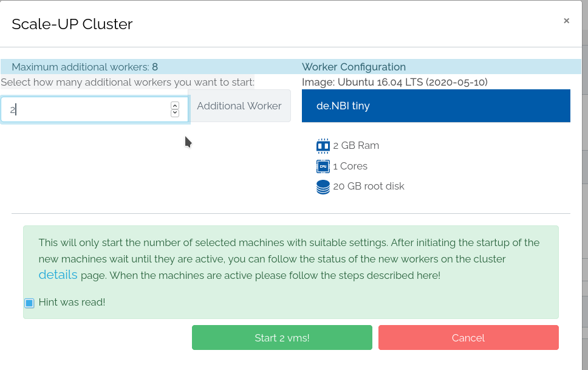
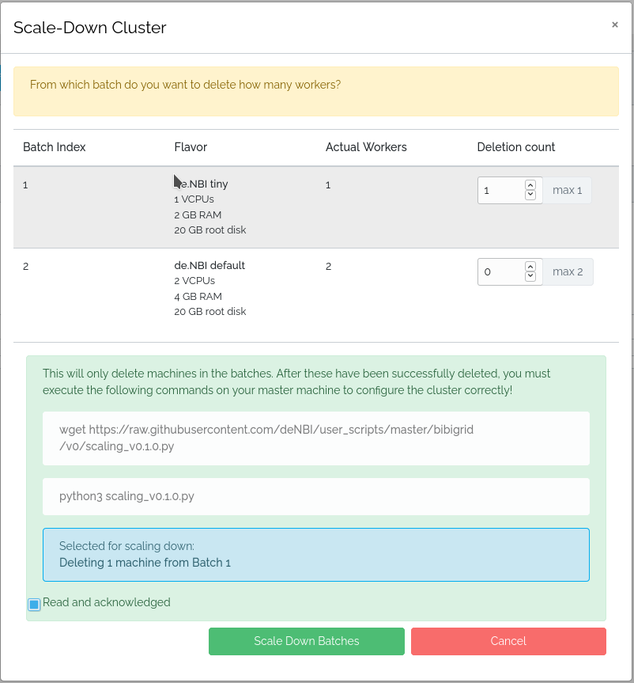

# Cluster overview

On this page we guide you through the cluster overview.

## Layout


### 1. General Cluster information
In the first row you will find the id of your cluster and its current status (clicking on the name will take you to the detail page of the respective cluster), the project it belongs to (clicking on the project name will take you to the project management page of the respective project), the name of the creator and the date it was created at.
### 2. How to connect
Clicking this button will show you commands and information on how to connect to the master instance of your cluster.
### 3. Scale-Up
It is possible to expand a cluster and add more workers by clicking on scale-up.
This will open a modal where you have to specify which batch should be expanded.



Therefore it is calculated how many maximum workers are possible in each batch.

**This will only initiate the start of the workers.
The cluster has to be configured correctly, so please wait until all new workers are active in the cluster detail overview until you configure the cluster!**

####  Configuring Master
For the cluster to use the new workers the master must be reconfigured.
Therefore  you have to do the following steps:


##### 1. Download a script:


```BASH
wget https://raw.githubusercontent.com/deNBI/user_scripts/master/bibigrid/scaling.py
```

You are able to check the version of the script by entering 
```BASH
python3 scaling.py -v
```

##### 2. Now the downloaded script has to be executed:

```BASH
python3 scaling.py 
```

When the script has run, your cluster is properly configured again and the new workers can be used!

You can check with the command _sinfo_ if the worker has been added correctly!

**If the new worker is still missing you can try to restart slurm with the following command:**
```BASH
sudo /etc/init.d/slurmctld restart
```
**If the worker is still missing after the command has been executed something went wrong and you should contact the support.**


### 4. Scale-Down
If you want to use less resources with your cluster you can also scale down your cluster by clicking the scale-down button.
<br>This will open a modal where you have to specify which workers should be deleted.



Once you have selected which batches should be scaled down and confirmed, these machines are deleted.<br>
**Your cluster must still be configured!**.

Therefore  you have to do the following steps:

##### 1. Download a script:


```BASH
wget https://raw.githubusercontent.com/deNBI/user_scripts/master/bibigrid/scaling.py
```

You are able to check the version of the script by entering 
```BASH
python3 scaling.py -v
```

##### 2. Now the downloaded script has to be executed:

```BASH
python3 scaling.py 
```

When the script has run, your cluster is properly configured again!


You can check with the command _sinfo_ if the workers have been removed correctly!

**If the  workers are still there you can try to restart slurm with the following command:**
```BASH
sudo /etc/init.d/slurmctld restart
```
**If the workers are still there after the command has been executed something went wrong and you should contact the support.**


### 5. Delete Cluster
This will delete the cluster and every vm belonging to it. If a volume is attached to a vm, it will get detached but not deleted!  


