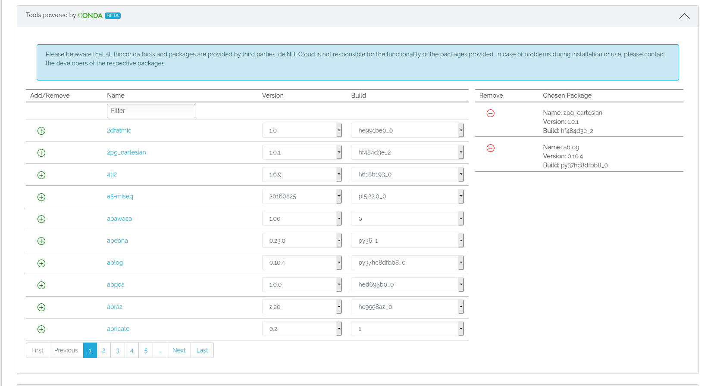
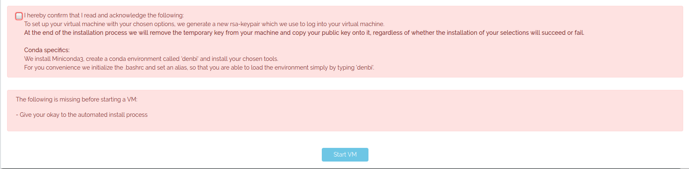
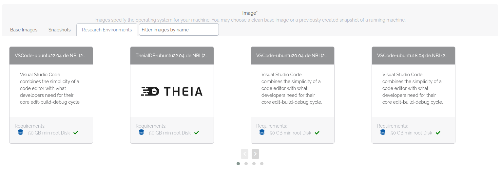
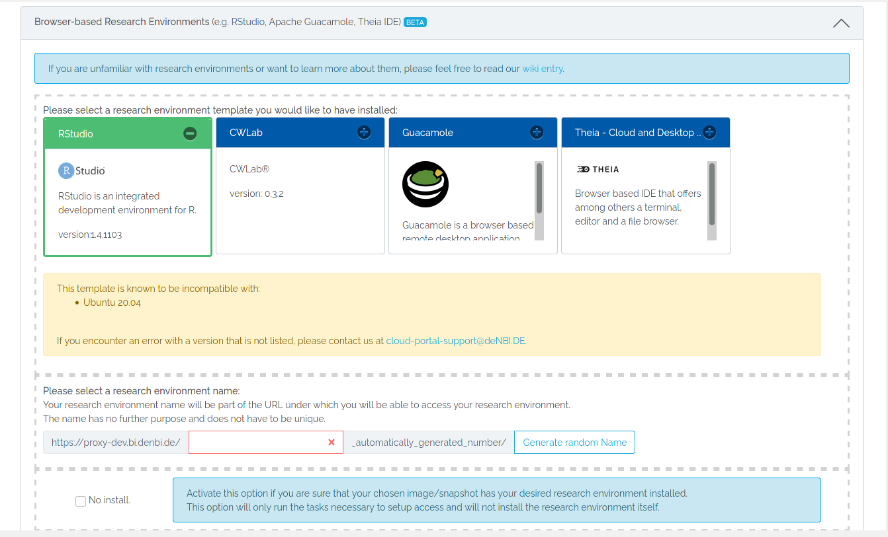
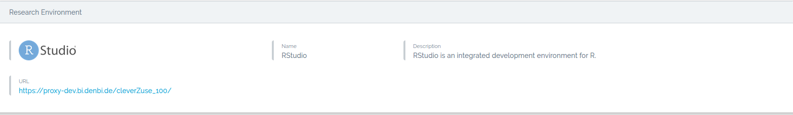
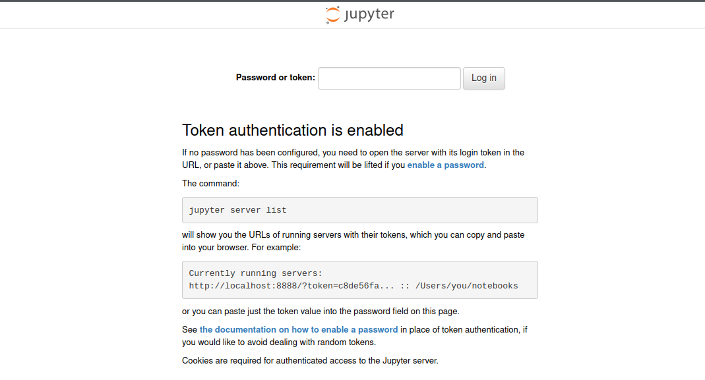
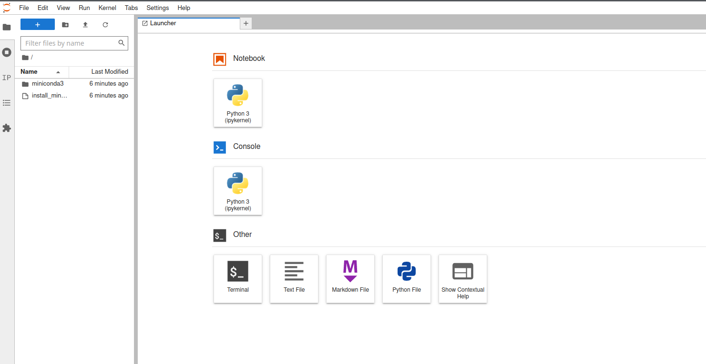
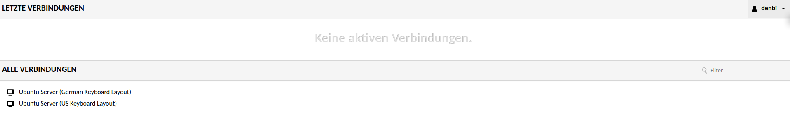
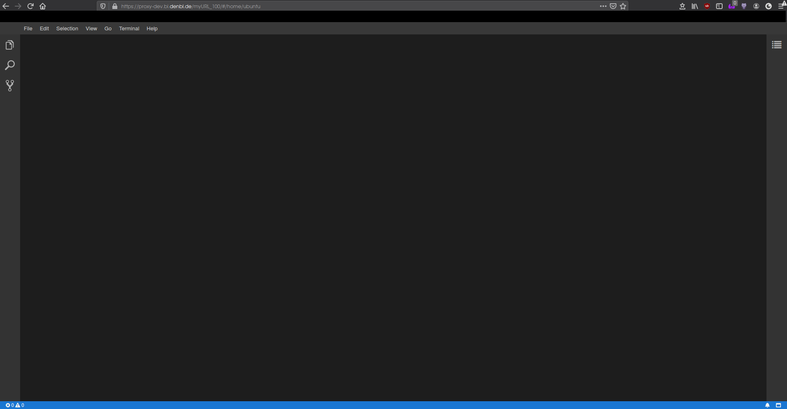

# Customization

You may customize your virtual machine at launch:

- [With Conda packages](#conda)
- [With a Research environment](#research-environments)

## Conda

>[Conda](https://docs.conda.io/projects/conda/en/latest/index.html) is an open-source package management system and 
>environment management system that runs on Windows, macOS, and Linux. Conda quickly installs, runs, and updates 
>packages and their dependencies. Conda easily creates, saves, loads, and switches between environments on your local 
>computer. It was created for Python programs but it can package and distribute software for any language.

???+ info "Responsibility for conda tools"
    Third parties create and support all conda tools. The de.NBI cloud isn't responsible for the 
    capability of the packages provided. 
    If problems occur during installation or use, please contact the developers of the respective packages.

### Choose tools and packages

Choose from a list of Bioconda, Anaconda, and Condaforge tools to install automatically at vm launch.
Filter by name to find the tools you need.<br>
Click on the green plus sign to add the tool or click the red minus sign to remove the tool from your
selection of tools.<br>



After choosing your tools and packages, you need to read and confirm the proceeding installation process.



### Installation process

??? info "Minoconda3"
    Miniconda3 will install, which is a lightweight package manager.
    We decided against the full Anaconda set of tools due to its size with over 1500 packages.<br>
    If you wish to install Anaconda, you will have to choose it from the list of packages.

We create a temporary private and public key pair to access your virtual machine at launch, and to
install your selection with [Ansible](https://docs.ansible.com/ansible/latest/index.html).
At the end of the installation process we remove the temporary key from your vm and copy your public key onto it,
regardless of whether the installation of your selection succeeds or fails.<br>
You may download the installation logs as a PDF or TXT file. See [Instance Detail](./instance_detail.md#ansible-logs) 
for more information.

### Environment

You get a [Conda environment](https://docs.conda.io/projects/conda/en/latest/user-guide/concepts/environments.html) 
named 'denbi'.
You may find your selection of tools in this environment.
For your convenience, the installation process initializes the `.bashrc` for conda and creates an alias, 
so that you may load the 'denbi' environment by running the command in your vm:

~~~shell
denbi
~~~

## Research environments

You may find a selection of research environments here you may use over your web browser, e.g., 
[JupyterLab](#jupyterlab), [RStudio](#rstudio), [Apache Guacamole](#apache-guacamole) or [Theia IDE](#theiaide). 
In the future, you may find more research environments added.<br>

???+ info "Use with Anti-Virus Software"
    In some situations, anti-virus sofware may cause you to experience connection problems with browser-based research environments. 
    If you experience difficulties connecting, it is advisable to check whether your anti-virus software may be blocking the connection.
    

### Select a research environment





To start a research environment on your virtual machine, either select a pre-build image provided by de.NBI from the 
“Research Environment” tab or select a base image and a research environment template. 
By using a template, the research environment installs at vm launch.<br>
Either way, name your research environment or click to generate a random name. 
This name appears in the unique URL used to access your research environment.

???+ tip "Pre-build images versus base image with a template"
    Virtual machines with pre-build images start faster than base images with a selected template.


??? info "Installation process"
    Like the [installation process of Conda](#conda), we create a temporary rsa-keypair, which we use 
    to install your research environment with Ansible.
    Afterward, we remove the temporary key and copy your public key 
    onto your virtual machine, whether the process succeeds or fails.
    When the process finishes, you may download and look into the installation logs.

### Find your research environment URL

To access your research environment, follow the Link you find on the [instance overview](./instance_overview.md) 
or on the [detail page](./instance_detail.md) of your virtual machine.



A LifeScience login prompt appears if you haven't already logged in with your LifeScience account.<br>
If you don't grant access to other members of your project on the detail page, 
only the person who started the vm may access the research environment.


### JupyterLab

>[JupyterLab](https://jupyter.org/) is the latest web-based interactive development environment for notebooks, code, 
> and data. Its flexible interface allows users to configure and arrange workflows in data science, scientific 
> computing, computational journalism, and machine learning. A modular design invites extensions to expand and 
> enrich functionality.

To access your JupyterLab research environment, follow the link you find, after starting your virtual machine, 
in the instance overview or on the detail page of your virtual machine.
A LifeScience login prompt appears if you haven't already logged in with your LifeScience account.<br>
Afterward a prompt to log in to JupyterLab with a Token shows.



#### Login Token

Use the following Token:
```
simplevm
```

Now you can work with JupyterLab by web browser.



### RStudio

>[RStudio](https://rstudio.com/products/rstudio/) is an integrated development environment (IDE) for R. It includes a 
>console, syntax-highlighting editor that supports direct code execution, as well as tools for plotting, history, 
>debugging and workspace management.

To access your RStudio research environment, follow the link you find, after starting your virtual machine, 
in the instance overview or on the detail page of your virtual machine.
A LifeScience login prompt appears if you haven't already logged in with your LifeScience account.<br>
Afterward a prompt to log in to RStudio shows.


#### Login credentials

Use the following credentials:
```
Username: ubuntu
Password: simplevm
```
If these credentials don't work, use the deprecated credentials (since 16.03.2020):
```
Username: ubuntu
Password: ogvkyf
```
Now you can work with RStudio by web browser.


#### Multiple users and concurrent sessions

To grant other users access to your research environment, add them to the allowed list of users.
You may find the list on the [detailed page](./instance_detail.md#user-management).

???+ warning "Concurrent sessions"
    This doesn't automatically allow for concurrent sessions, i.e., your session terminates 
    once another user logs in with the same credentials.<br>
    For concurrent sessions, see this [guide](./rstudio.md).


### Apache Guacamole

> [Apache Guacamole](https://guacamole.apache.org/) is a clientless remote desktop gateway. It supports standard 
>protocols like VNC, RDP, and SSH. We call it clientless because no plugins or client software are required. Thanks to 
>HTML5, once Guacamole is installed on a server, all you need to access your desktops is a web browser.

???+ info "Rebooting a guacamole vm"
    After rebooting your vm or turning your vm from shutoff to active, 
    it takes about 15 minutes until you may access your Apache Guacamole research environment.

To access your Apache Guacamole research environment, follow the link you find, after starting your virtual machine, 
in the instance overview or on the detail page of your virtual machine.
A LifeScience login prompt appears if you haven't already logged in with your LifeScience account.<br>
Afterward a prompt to log in to Apache Guacamole shows.


After logging in, choose a keyboard layout.



#### Login credentials

Use the following credentials:
```
Username: denbi
Password: denbi
```

???+ info "Password prompt on inactivity"
    It may happen that, because of inactivity, a prompt for the password of the ubuntu user shows: 
    ```
    ogvkyf
    ```

Now you can work with Apache Guacamole by web browser.


#### Multiple users and concurrent sessions

To grant other users access to your research environment, add them to the allowed list of users.
You may find the list on the [detailed page](./instance_detail.md#user-management).

???+ warning "Concurrent sessions"
    This doesn't automatically allow for concurrent sessions, i.e., your session terminates
    once another user logs in with the same credentials.<br>
    For concurrent sessions, see this [guide](./guacamole.md).

### TheiaIDE

> [Eclipse Theia](https://theia-ide.org/) is an extensible platform to develop full-fledged multi-language Cloud & 
>Desktop IDE-like products with state-of-the-art web technologies.

Find more information on TheiaIDE on the [tutorial page](../Tutorials/TheiaIde/index.md).

To access your TheiaIDE research environment, follow the link you may find, after starting your virtual machine, 
in the instance overview or on the detail page of your virtual machine.
A LifeScience login prompt appears if you haven't already logged in with your LifeScience account.<br>
Now you can work with Theia IDE by web browser.


