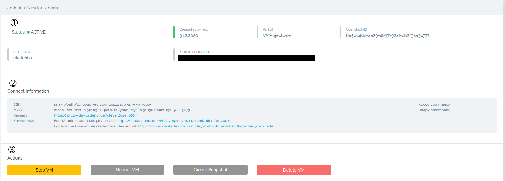
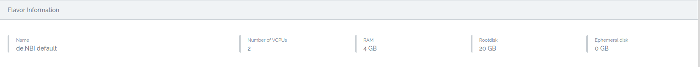
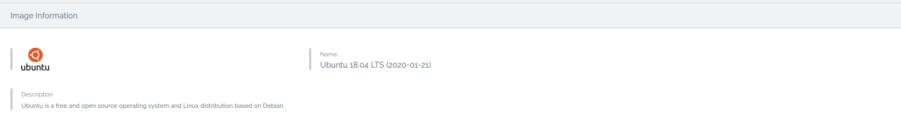
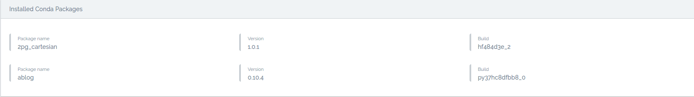
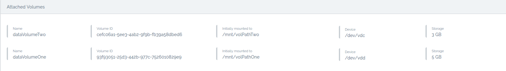
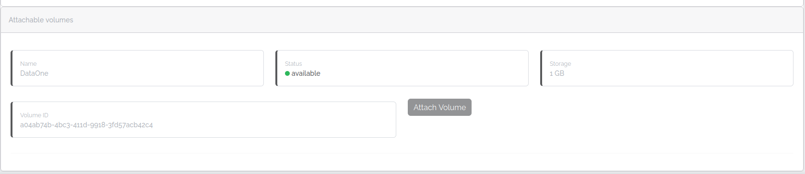
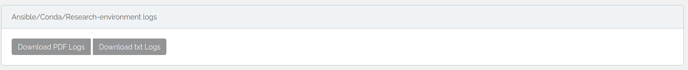

# Instance detail

The detail page offers more information about a virtual machine and extra actions.

## General information

1. The name, who created it and when, their Elixir ID, what project the vm belongs to, and the unique OpenStack 
ID of the virtual machine.
2. How you can access the virtual machine.
3. Actions you can perform:
    * Stop VM 
      Shutoff the virtual machine. You may resume it afterward, but you can't access it while in "SHUTOFF" state.
    * Reboot VM 
      [Soft or hard](https://docs.openstack.org/mitaka/user-guide/cli_reboot_an_instance.html) reboot your virtual 
      machine.
    * Create Snapshot 
      Take a snapshot of the virtual machine. 
      See [here](snapshots.md) for more information.
    * Delete VM  
      Delete the virtual machine. Any attached volume gets detached but not deleted.
    * Resume/Restart VM  
      Boot up the "SHUTOFF" virtual machine.

## Flavor information

Get information about the resources the vm uses. For more information on flavors, 
see the [flavors](../Concept/flavors.md) wiki page.

## Image information

Get information about the image the VM runs on. To find more information about images and snapshots, 
see the [image and snapshots](./snapshots.md) wiki page.

## Conda packages

Get an overview of the tools and packages installed on the virtual machine at launch.
For more information, see the [customization](./customization.md#conda) wiki page.

## Attached volumes

Get information about attached volumes or detach an attached volume. 
Find the name, the unique OpenStack ID, the path initial mount path, the device name, and the storage capacity. 
For more information on volumes, see the [volume](./volumes.md) wiki page.

## Attachable volumes

Get information about attachable volumes and attach them with one click. 
Find the name, the unique OpenStack ID, the status, and the storage capacity.
For more information on volumes, see the [volume](./volumes.md) wiki page.

## Research environment

Get information about the installed browser-based research environment. 
For more information, see the [customization](./customization.md#research-environments) wiki page.

### User management

Grant and revoke access to the research environment. 
To grant access, a user has to be a member of the project.

???+ warning "Concurrent sessions"
    This doesn't automatically enable concurrent sessions, i.e., your session terminates
    once another user logs in with the same credentials.
    For information on concurrent sessions, see the specific 
    section of the [research environment](customization.md#research-environments).

## Ansible logs

Download the ansible logs of the installation that ran at launch. Download as PDF or txt file.
