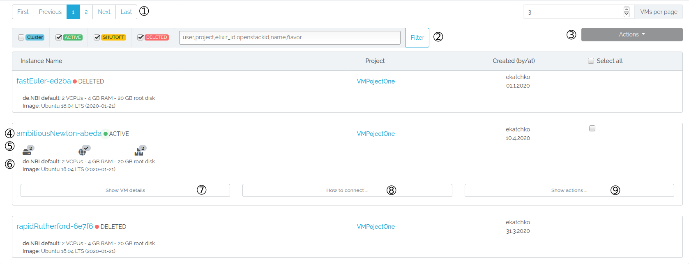
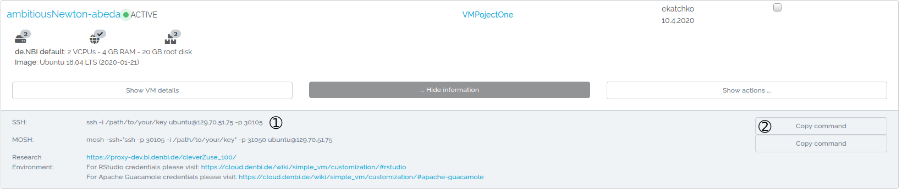
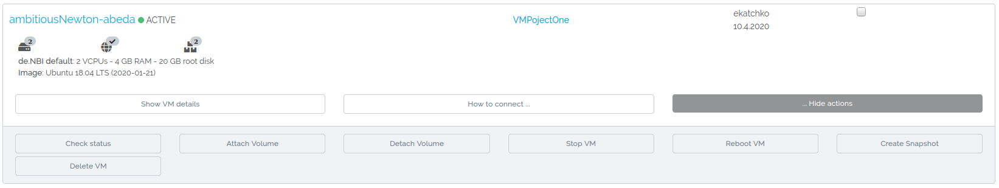

# Instance overview

On this page we guide you through the instance overview.

## Layout

### 1. Pagination
Here you may set how many VMs you want to see per page and scroll through the pages.
### 2. Filter
Here you may filter your list of VMs. In the text field you may filter by username, projectname, elixir id of a user, vm id in openstack, vm name and flavor. Do not forget to click 'Filter' to activate the filter.
### 3. Actions
Here you will find some actions which will be run on all VMs selected by the checkbox you will find at the right of each virtual machine. Also you may choose to select all VMs by clicking 'Select all'.
### 4. General VM information
In the first row you will find the name of your virtual machine and its current status (clicking on the name will take you to the detail page of the respective virtual machine), the project it belongs to (clicking on the project name will take you to the project management page of the respective project), the name of the creator and the date it was created at and a checkbox to select the virtual machine.
### 5. Descriptive icons
In the second row you will find some icons depicting some information about your virtual machine:  

* if and how many volumes are mounted  
* if a research environment is installed and available. Clicking this icon also copies the URL under which you may find your browser based research environment.  
* if and how many conda tools were installed when starting the virtual machine.
### 6. Flavor/Image
In the third row you will find which flavor and image is run on the virtual machine.
### 7. Show VM details button
This button will take you, like a click on the instance name, to the virtual machine detail page.
### 8. How to connect
Clicking this button will show you commands and information on how to connect to your virtual machine.
  

1. Depending on your chosen options when starting a virtual machine, you will find different information here.  
2. The 'Copy command' button which you will find next to it copies only the needed command and not the full text.
### 9. Actions
Here you will find some actions you can execute.
  

###### Check status
This will check the status of your virtual machine.  
###### Attach Volume
This will let you choose an already created volume and attach it to the virtual machine.  
###### Detach Volume
This will let you choose an attached volume and detach it from the virtual machine.  
###### Stop VM
This will shutoff the virtual machine, also setting the status to 'SHUTOFF'. It will be resumable, but you will not be able to interact with it in any form while it is shutoff.  
###### Reboot VM
This will either soft reboot or hard reboot your virtual machine. A soft reboot attempts a graceful shut down and restart of the instance. A hard reboot power cycles the instance.[^1]  
###### Create Snapshot
This will let you take a snapshot of the virtual machine, allowing to boot a new virtual machine with it. For more information on snapshots please visist the [respective wiki page](./snapshots.md).  
###### Delete VM
This will delete the virtual machine and everything on it. If a volume is attached, it will get detached but not deleted!  
###### Resume/Restart VM
This will boot up your shutoff virtual machine.

[^1]: https://docs.openstack.org/mitaka/user-guide/cli_reboot_an_instance.html
