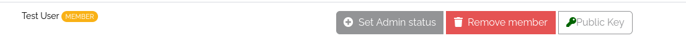

#SSH keys and sharing access

##Basic
A keypair consists of a public key and a private key. A public key is used to encrypt data, a private key is used to 
decrypt data, which is why a private key should in most cases not be shared. You can imagine a public key encryption as a 
padlock which you close once data is encrypted with it. A private key would be the key which unlocks the padlock.  
If you place a public key on a virtual machine (with which you wish to communicate), the data the virtual machine sends you will be 
encrypted by the public key. The corresponding private key is now needed to decrypt the data the virtual machine sends you.  
Fortunatley, this happens automatically when using a secure shell or SSH for short. The virtual machine encrypts the data with the 
public key (or even multiple public keys) which is/are placed on it and it gets decrypted with the private key you use to 
establish a SSH connection, e.g. by using
```shell
ssh ubuntu@<IP> -i /path/to/your/private/key -p <PORT> 
```
This also means the following things:  

1. When you use a private key which does not correspond to a public key which is placed on your virtual machine, the data 
   can not be decrypted and you are not able to access *any* data on the virtual machine. **You lose all access to the machine**.  

2. When the public key on your virtual machine should somehow in any way change, only a private key which corresponds to this 
   particular public key will be able to decrypt the data. If you do not possess this private key, **you lose all access to the machine**.  

3. Only someone with access to the machine is able to change the public keys which the virtual machine recognizes and uses. 
   We, **the whole staff of the de.NBI Cloud**, do not belong to the people which are able to access your virtual machine and change 
   its public keys. Your virtual machine, once active, will only recognize the public key you have set on your profile page 
   when you started the virtual machine. Of course this excludes special options we offer, like starting virtual machines 
   for a workshop or our offer to place public keys of selected members of your project onto the machine when starting it.
   Therefore, once your virtual machine is started, **no one but the people you allowed it**, are able to change the public keys 
   on your virtual machine.

!!! warning "On key pair security"
    *Every* padlock is designed to be opened somehow. Therefore no padlock in existence can guarantee you 100% security, 
    very good padlocks can only guarantee you a sufficiently good enough security. 
    This also applies to key pairs. Modern key pairs, like the ones you are able to create on our profile page, guarantee 
    you a good enough security with the state of our current collective knowledge. They do *not* guarantee you a good enough security 
    for every future to come.

It is **mandatory** that you set a public key on your profile page when you want to start a virtual machine. After it is started 
only the private key which corresponds to the public key which was set on your profile page when you initially started the virtual 
machine will be able to access it and decrypt the data it sends you.  
**You lose the private key, you lose access.**

More information about the profile page and how to generate a key pair on our profile page can be found 
[here](../portal/user_information.md#ssh-key).

If you want to know more about the technical details of key pairs [wikipedia](https://en.wikipedia.org/wiki/Public-key_cryptography) 
is a good enough first point of contact.

##Sharing Access
If you want to share access to one of your virtual machines the person you want to share it to needs to give you their public ssh key.

!!! info
If set, you can easily find the public key of another project member via the project overview in the members list. 


If they do not have a ssh key pair yet, they need to generate it, e.g., using ssh-keygen. After you have obtained their public key you need to
add the key to your virtual machine.

If you are using a Linux distribution this can be done via the following command:

> ssh-copy-id -i {PUBLIC_KEY} -p {PORT} ubuntu@{IP_ADDRESS}

You can find the PORT and the IP_ADDRESS in you virtual machine overview under "Connect Information". PUBLIC_KEY is the name and path of
the public ssh key of the person that you want to share access to.

Otherwise, use the following steps to add a user to a virtual machine

1.
Connect to your machine as usual.

2.
Use the command:
> nano .ssh/authorized_keys

This opens the file in which all your keys are saved who have access to your virtual machine. Your key is already in that file, do not change it.

3.
Copy the public key of the person you want to add (important- not the private key) and add it to the line after your key to the file.
Using CTRL-X you can close the file. When you are closing the file you are asked whether you want to save your changes. Please confirm this.

Now the other user can access your virtual machine. If you run into troubles please contact us via cloud-helpdesk@denbi.de.

##Reminder
Please only add the ssh key of people you trust. Furthermore, you are still responsible for the virtual machine if you share your
access with other people.
