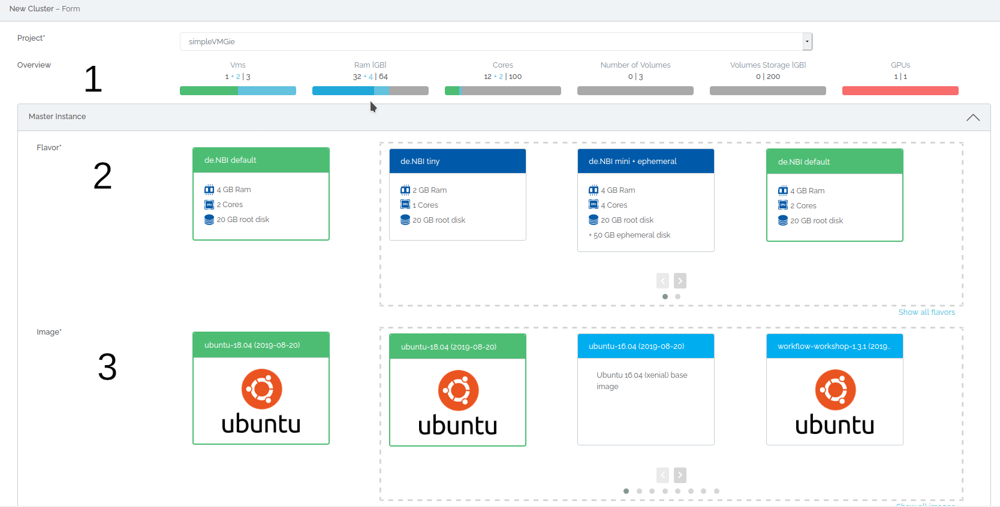
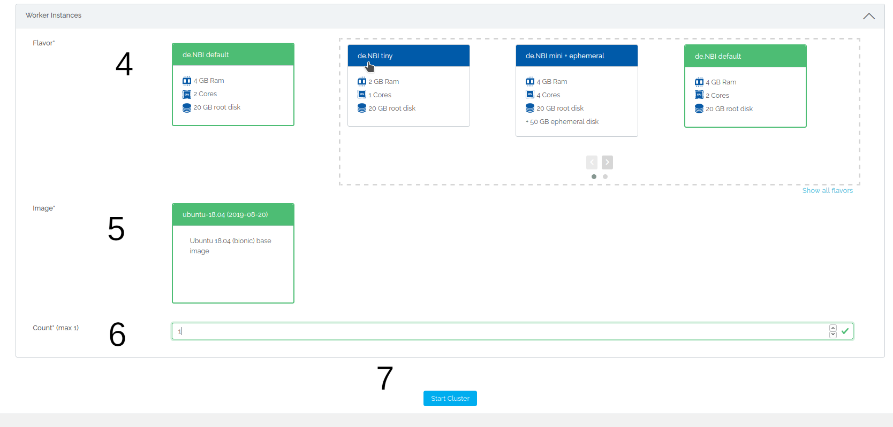

# Starting a cluster

On this page we guide you through the options you have when starting a cluster.  
If you are a member of a simple vm project, where cluster creation is allowed, you can start a cluster at the "New Cluster" tab.  
You may need to reload the website if you can not see the tab.

## Mandatory configuration

### 1. Overview
Here you get an overview of your allocated ressources and how much of it is currently in use. If your allocated ressources do not allow to start a cluster your PI may request more ressources.
It also shows which other resources are occupied by the current cluster configuration.

### 2. Master Flavor
Here you may choose the flavor for your master virtual machine. Flavors dictate the ressources your virtual machine will be started with. For more information about flavors please visit the [flavor wiki page](../Concept/flavors.md).

#### Information for ephemeral flavors:
Ephemeral storage is additional disk space for the operating system and temporary data such as cache, buffers, session data and other. This type of storage is already available as an additional disk when the VM is started.  The data on the ephemeral disk is not lost by restarting a paused machine. However, unlike volumes of the Object Storage type, the data is irretrievably deleted without additional backup on a volume as soon as the instance is deleted/terminated. When creating a snapshot of an instance, the data on the ephemeral disk is not included! 

Ephemeral storage suits best for temporary data that changes often or is consistently replicated across your environment. It offers faster access and faster loading of data.
[Object storage volumes](#1-volumes) are best suited for data that must be persistent.

### 3. Master Image
Here you may choose the image your master virtual machine will be started with. Images are basically the operating system and tool packages which will be installed on your virtual machine. The images listed here are the ones provided by de.NBI and your created snapshots. For more information about images and snapshots, please visit the [wiki page](./snapshots.md).

### 4. Worker Flavor
Here you may choose the flavor for your worker virtual machines.
Currently every worker must have the same flavor.

### 5. Master Image
Here you may choose the image for your worker virtual machines.
Currently every worker must have the same image.

### 6. Worker Count
Depending on how many resources you have available in your project and which master and worker flavor you have chosen, you can start a certain amount of workers.

### 7. Start Cluster
Here you finally may start your cluster. After a short time, you will be redirected to the [Cluster Overview](./cluster_overview.md) page.
