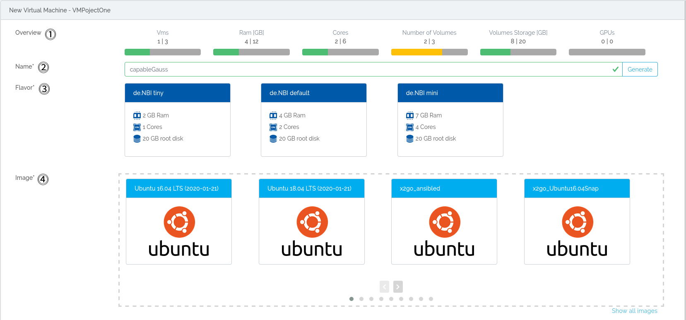
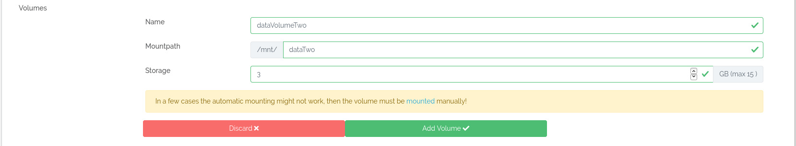
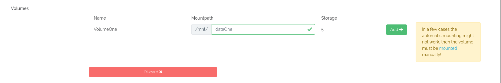
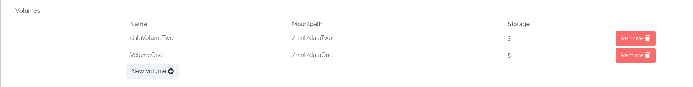
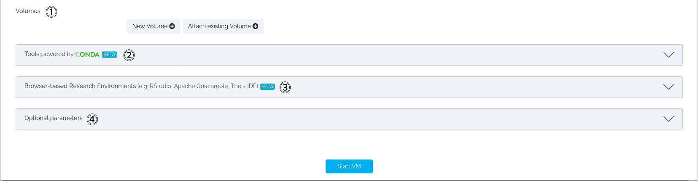
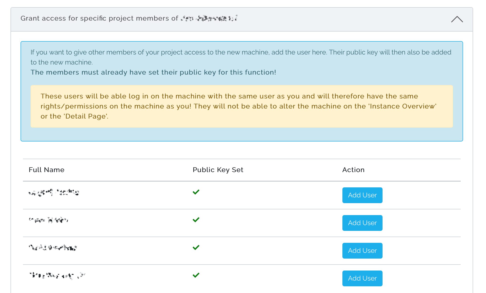
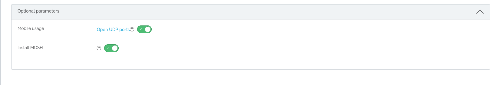

# Starting a virtual machine

On this page we guide you through the options you have when starting a virtual machine.  
If you are a member of a simple vm project you can start a virtual machine at the "New Instance" tab.  
You may need to reload the website if you can not see the tab.

## Mandatory configuration

### 1. Overview
Here you get an overview of your allocated ressources and how much of it is currently in use. If your allocated ressources do not allow to start a virtual machine, your PI may request more ressources.

### 2. Name
Here you may name your virtual machine or use a randomly generated name. An unique id will be appended after starting your virtual machine.

### 3. Flavor
Here you may choose the flavor for you virtual machine. Flavors dictate the ressources your virtual machine will be started with. For more information about flavors please visit the [flavor wiki page](../Concept/flavors.md).

#### Information for ephemeral flavors:
Ephemeral storage is additional disk space for the operating system and temporary data such as cache, buffers, session data and other. This type of storage is already available as an additional disk when the VM is started.  The data on the ephemeral disk is not lost by restarting a paused machine. However, unlike volumes of the Object Storage type, the data is irretrievably deleted without additional backup on a volume as soon as the instance is deleted/terminated. When creating a snapshot of an instance, the data on the ephemeral disk is not included! 

Ephemeral storage suits best for temporary data that changes often or is consistently replicated across your environment. It offers faster access and faster loading of data.
[Object storage volumes](#1-volumes) are best suited for data that must be persistent.

### 4. Image
Here you may choose the image your virtual machine will be started with. Images are basically the operating system and tool packages which will be installed on your virtual machine. The images listed here are the ones provided by de.NBI and your created snapshots. For more information about images and snapshots, please visit the [wiki page](./snapshots.md).

### Volumes
Here you may create, attach and mount a new volume or attach and mount an already existing volume.  
For more information about volumes, please visit the [volume wiki](./volumes.md) page.

Click on `New Volume` and you will see:

 You may name your volume, choose its mountpath, which is the path to the data saved on the volume and choose the amount of storage.  

Click on `Attach existing Volume` and you will see:

You may choose its mountpath, which is the path to the data saved on the volume.  

After adding a volume you will see an overview of your chosen volumes:

## Optional configuration

### 1. Conda tools

Here you may choose multiple conda, bioconda and anaconda tools which will be installed on your machine at startup. For more information, please visist the [customization wiki page](./customization.md#conda).

### 2. Research environments

Here you may choose from different browser based research environments respectively web IDEs, which will be installed on your machine at startup. For more information, please visist the [customization wiki page](./customization.md#research-environments).

### 3. Grant Access for project members

When you start a virtual machine, you are able to grant access to it for any other member of your project.
You can grant access only to members of your project who already have an SSH key stored in the portal. This is displayed for members who have not stored a key. You can find out how to set an SSH key [here](./portal/user_information.md/#ssh-key).
After starting the machine, you and all added members can connect to the machine with their respective keys. 
Note that all users on the machine have the same rights and do not have separate home directories.
Only the person who initially started the machine can stop, restart or delete it.  

### 4. Optional parameters

Here may find some additional options for your virtual machine.
#### MOSH / UDP ports
Here you are able to open UDP ports and have MOSH installed on your virtual machine. Open UDP ports allow for better mobile usage and MOSH is used/needed to connect to your virtual machine via UDP. For more information on using UDP ports and MOSH, please visist the [respective wiki page](../Tutorials/Mosh/index.md).

## Start VM
Here you finally may start your virtual machine. After a short time, you will be redirected to the [Instance Overview](./instance_overview.md) page.
