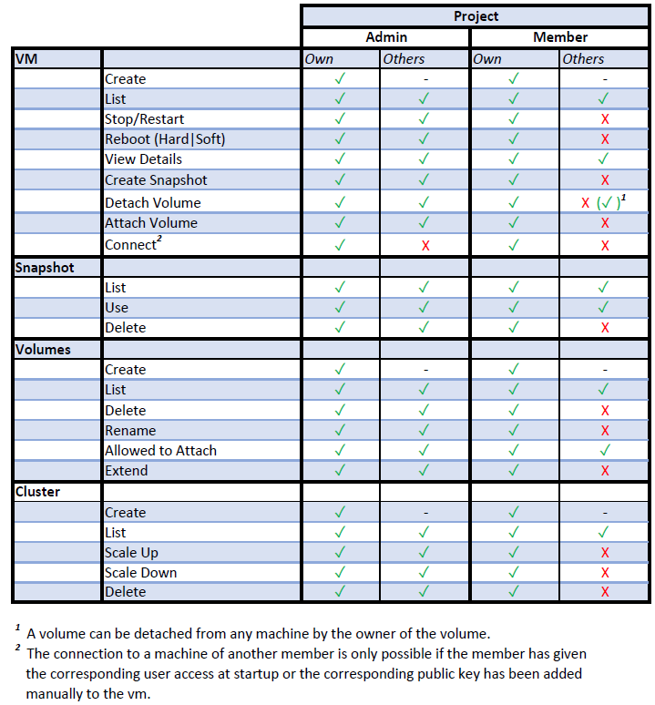

# Group Permissions

There are two roles within a project: **admins** and **non-admins**.  
Especially for SimpleVM projects, these roles play an expanded role in resource usage authorization.    
An **admin** generally has all rights, not limited to own resources (like vms).  
**Non-admins** are generally only allowed to modify their own resources - unless they have been explicitly granted access.
    The following table illustrates the different rights:

| Type                  | Project               |                       |                       |                       |
| --------------------- | --------------------- | --------------------- | --------------------- | --------------------- |
|                       | Admin                 |                       | Member                |                       |
|   VM                  | Own                   | Others                | Own                   | Others                |
| --------------------- | --------------------- | --------------------- | --------------------- | --------------------- |
| Create                | :material-check-all:  | :material-check:      | :material-check-all:  | :material-close:      |
| List                  | :material-check-all:  | :material-check-all:  | :material-check-all:  | :material-close:      |
| Stop/Restart          | :material-check-all:  | :material-check-all:  | :material-check-all:  | :material-close:      |
| Reboot (Hard & Soft)  | :material-check-all:  | :material-check-all:  | :material-check-all:  | :material-close:      |
