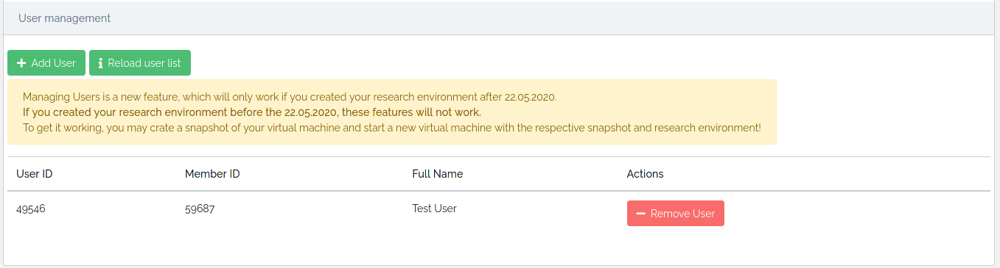
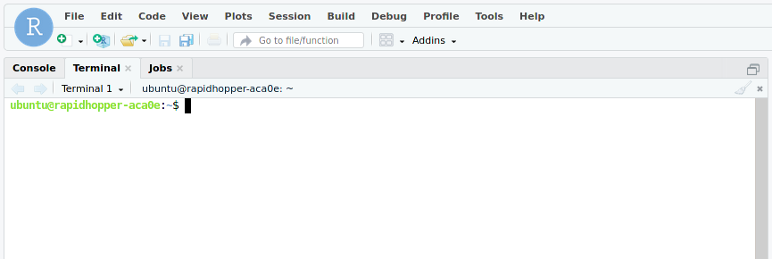
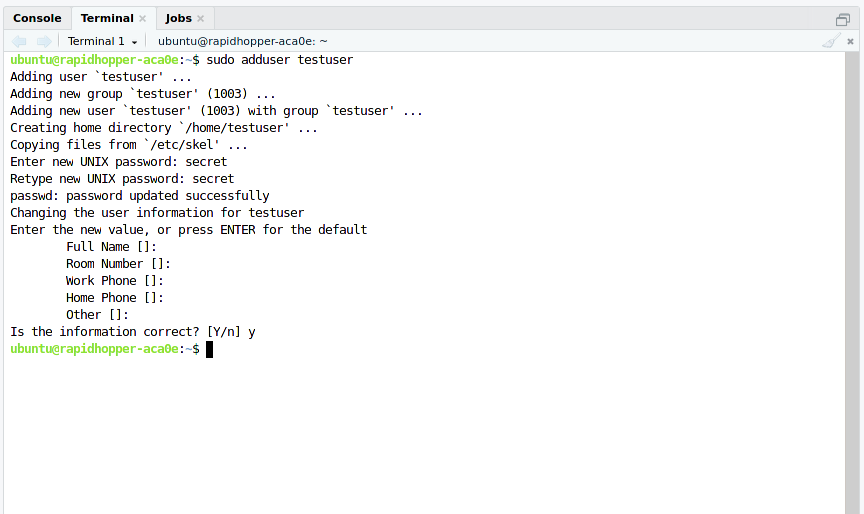

# Enable concurrent sessions for RStudio

By default, one concurrent session can log in per username.
To have more than one person logged in with different usernames,
you need to add them first by following these steps.

## Add user to research environment

If you haven't already done so, add the user to your research environment on the
[instance detail page](./instance_detail.md#user-management).

  

## Add new user to the machine

Access RStudio as usual using your unique URL.<br>
Open the terminal tab:

  

### Create a new user

Add a new user:

```shell
sudo adduser USERNAME
```

Replace USERNAME with the name that you want to use.
The USERNAME must not yet exist on the machine.
Remember the password when asked, you need it later.
You can answer the other questions however you want or leave them blank.
This creates a new home directory for USERNAME.



???+ warning "Password not hidden"
    Due to the nature of the research environment, the terminal doesn't hide the password you typed to create the
    user. Stay aware of this when adding a user in front of others.

### Grant root privileges (optional)

If you want to give the new user root privileges, use:

```shell
sudo usermod -aG sudo USERNAME
```

Replace USERNAME with the name of your created user.

###  Log in

Now another user can log in with the credentials `USERNAME` and `PASSWORD` to start a
concurrent session.
You need to repeat this process for every user who wants to run a concurrent RStudio session on this virtual
machine.
