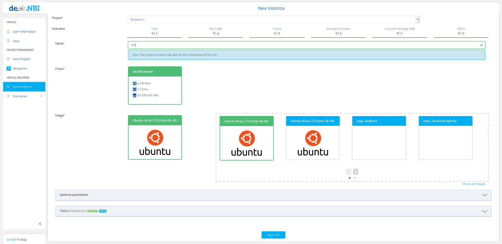
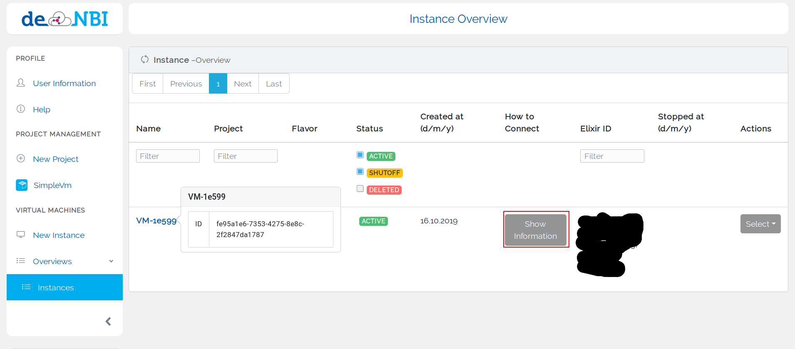

## Simple VM Project

### Start a Virtual Machine
If you are a member of a simple vm project you can start a virtual machine at the "New Instance" tab.
You may need to reload the website if you can't see the tab.
Then you can choose your project and fill the form to start a virtual machine.

With the optional params you can start the vm with a volume [see](../volumes#create-volume).
Also if you want to use mosh (see https://mosh.org/ ) you can choose to open UDP ports.

### Connect to your Virtual Machine
After the virtual machine has been started you will be redirected to the Instance Overview.

Here you can find general information about how to connect to your virtual machine and only if you chose to open UDP ports mosh-connection information is shown too.

### Images

#### X2Go Image

X2Go Images allow you to start your own desktop in the de.NBI Cloud which you can access from
any operating system (Windows, Linux, MacOS).

!!! Guacamole
    Please note, that as an alternative we now offer [Apache Guacamole](customization.md#apache-guacamole).

## (Windows only) Export key in OpenSSH format for X2GO

To connect to a machine with X2GO you have to export your private key in openssh format. To achieve this first load your private key into puttygen.

Then click Conversions and choose Export OpenSSH Key. Afterwards save this file on your computer. This file will be needed when you want to establish a connection to a machine with the X2GO client.

## Connect to X2GO machine

You can start an X2Go image when you select an image starting with the X2Go label e.g `X2Go_xfce`.
Once your image started, you will see a message similar to the following one:

Provide the data in the red rectangle in the settings of your x2go client:

You also have to select the session type and the private key of your public ssh key that you provided in the user information tab.
