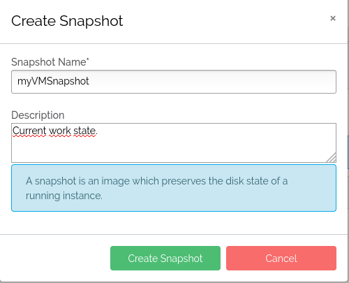
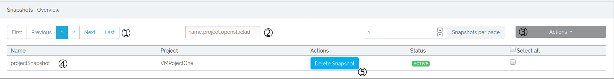
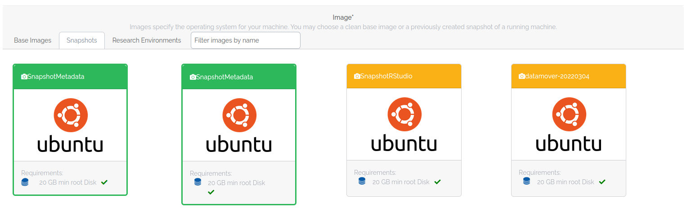

# Images and Snapshots

## Images
Images are files that contain a bootable operating system, e.g. Linux derivatives. Each of the different compute center provide a selection of Images you may use to boot up a virtual machine. If you want more behind-the-scenes information, please visit the respective wiki page.

## Snapshots
A snapshot is an exact copy of your virtual machine. A snapshot of an instance can be used as the basis of an instance and booted up at a later time. 

!!! Info 
    A snapshot also preserves the full state of RAM, therefore only snapshots up to a maximum of 256 GB RAM are supported.

### Create Snapshot
After starting a machine you can go to the [instance overview](instance_overview.md#9-actions) tab and create a snapshot.  
A window opens where you can enter a name for your snapshot and confirm it by pressing Create Snapshot.  

### View Snapshots
  

1. Here you may set how many snapshots you want to see per page and scroll through the pages.
2. Here you may filter your list of snapshots. In the text field you may filter by name, project name and the snapshot openstackid.
3. Here you will find some actions which will be run on all snapshots selected by the checkbox you will find at the right of each snapshot. Also you may choose to select all snapshots by clicking 'Select all'.
4. Here you will find some information about your snapshot: the name of the snapshot, the project name and the status.
5. Here you may delete the snapshot.
### Start Snapshot
After the snapshot is successfully created you can go to the [new instance](./new_instance.md) tab and choose the created snapshot as an image to start a vm. 
