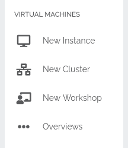

# Workshops
On this page we will show you how to create a workshop, where to get more information on your workshop and 
also some good general practices.
!!! Info
    To manage your workshop via the portal, you will need an approved SimpleVM project where you chose that you would 
    like to conduct a workshop. Only admins of the project are allowed to manage workshops.
## Create a new workshop
We offer you the ability to manage your workshops more conveniently. You may create a workshop and start multiple virtual 
machines for your participants with just a few clicks. 

You will find the New Workshop button on the sidebar (a SimpleVM project for workshops which you are an admin of is required 
for this button to show).  

Here you may choose your SimpleVM project and then either select an existing workshop or create a new one. There is no limit 
on how many workshops you may create with your SimpleVM project.  

!!! Note
    The shortname of your workshop will be used, inter alia, for naming of virtual machines and research environment links.
### Start virtual machines for your participants
Once you select a workshop, you will see a form similiar to the [New Instance](new_instance.md) form.  

You will need to select a flavor, an image, a research-environment and the participants you want to start a virtual machine 
for. You may also start virtual machines for your admins and at participant selection you will see an icon if a virtual 
machine is already started for the participant. You may start as many virtual machines for a participant as you have resources.  

The machines and the research-environment links will be named automatically and will have the form 
`<WORKSHOP-SHORTNAME><PARTICIPANT-LASTNAME><PARTICIPANT-FIRSTNAME>` and will be truncated to a maximum of 25 characters.  
We will place the public SSH key of every admin of your project on every started machine, so that every admin of your project has 
SSH access to every started machine.  
The research-environment will be accessable by the participant and the admin who started the virtual machine.  

Once you selected everything you need and confirmed the checkboxes at the bottom of the for, you may start the virtual machines 
and you will get taken to the instance overview, where you will find more information about the status of the virtual machine.  

## Workshop overview
You may find an overview of your created workshops at your [project overview](../portal/project_overview.md). Here you will find 
the participants name, the participants preferred E-Mail address and the link to the research environment of the participants virtual 
machine.  

## Best Practices

### Preparation
It is advised to add your participants to your project a couple of days beforehand. This will help with a smoother 
start of your workshop. They will need to have or make an account for the de.NBI portal in order for you to add them. 
If you are not sure if they have an account you can send your participants the [wiki site](../registration.md) where 
the registration process is explained. 

### SSH keys
!!! Info
    If your participants do not need to login to their machines with SSH, please ignore this paragraph.

There are many users to whom the concept of SSH keys is foreign and therefore it is important to explain 
the users the basic concept of SSH keys, in case that they have no prior knowledge about them.
Furthermore, it is important to tell users to pay attention if they create a key pair using the de.NBI portal. While 
the public key is stored on the portal, they need to save the private key on their computer themselves.  
As workshops tend to have a lot of new content and participants may be overwhelmed, it is important to 
explain them these steps patiently and make sure everyone follows through, as they will not be able to access their 
machines later on, if they lose their private key.
!!! Tip
    Make sure the admins of your project also have their SSH key set.

### Access to machines

!!! Info
    

## Trouble Shooting
If you experience troubles, have feedback on our services or have a special request please do not hesitate to contact 
us under cloud-portal-support@denbi.de.
