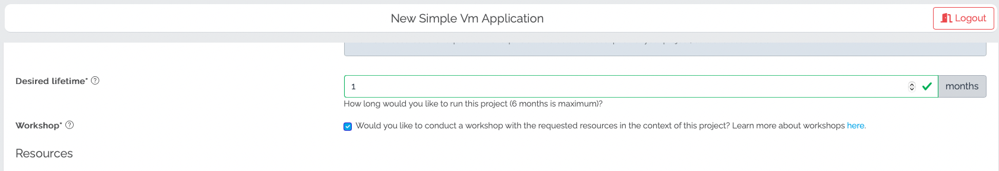
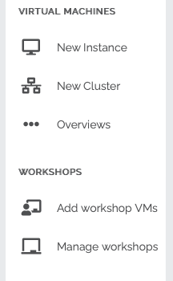
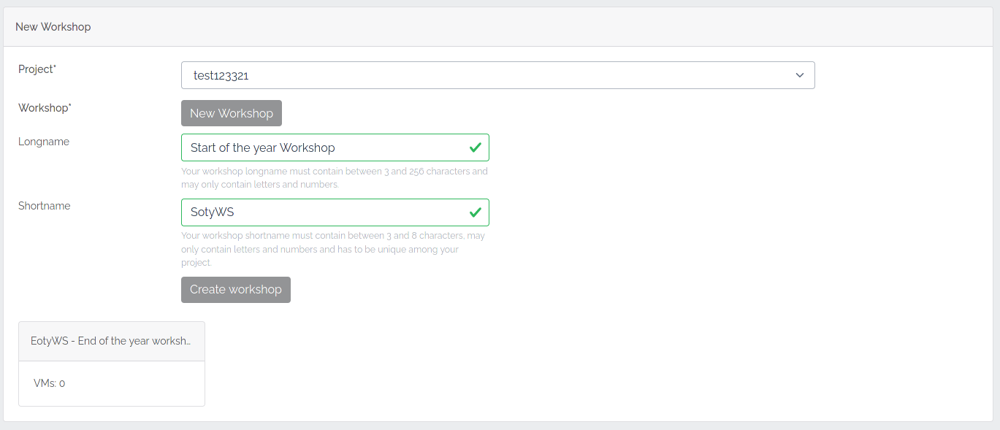
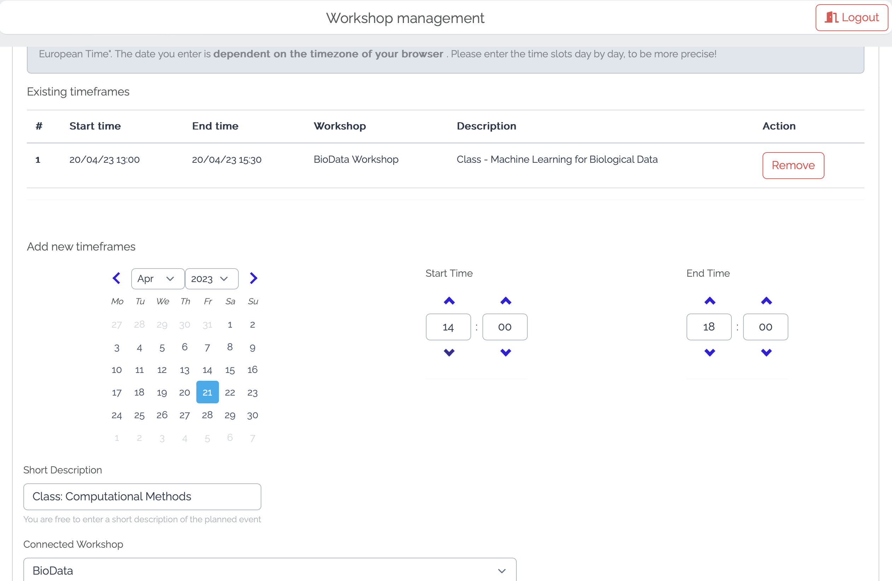
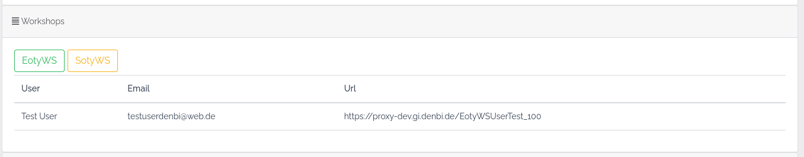
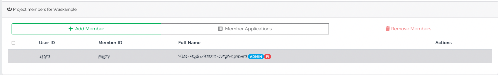
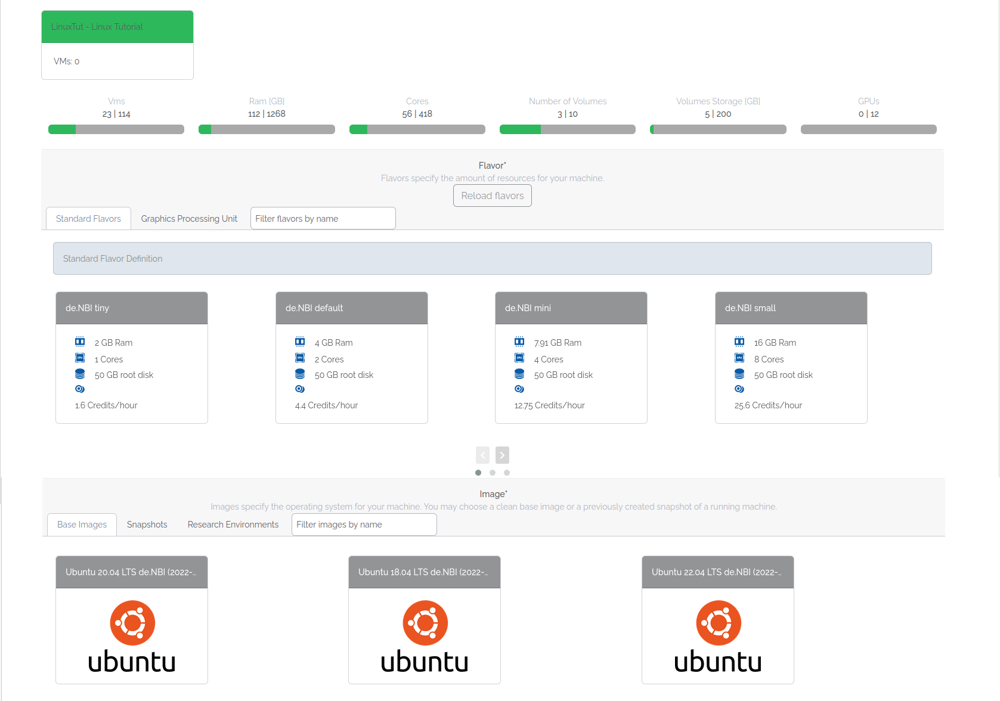
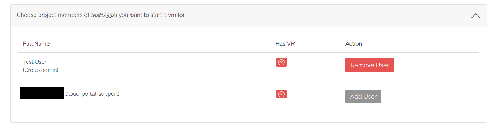
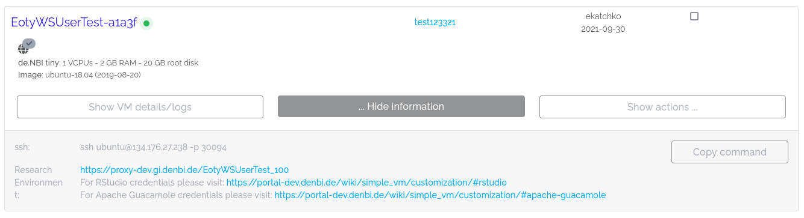

# Workshop management

You can manage your workshops conveniently with SimpleVM.
Create workshops in your SimpleVM project, add users and administrators, and launch virtual machines
for your users with a few clicks.

On this page, you learn:

- How to create and manage a workshop.
- How to start instances for your workshop participants.
- How to inform your participants about their machines.
- Good general practices and tips for workshop and vm management.

## Requirements

Only administrators in a SimpleVM project with workshops activated can use the workshop tools. 
If you have no SimpleVM project, you need to apply for a SimpleVM project with `Workshop` marked,
see the [Portal](../portal/allocation.md) wiki page for more information about the application process.

If you have a SimpleVM project without workshop activated, but would like to conduct one in the context of your 
project, contact the de.NBI helpdesk at [cloud-helpdesk@denbi.de](mailto:cloud-helpdesk@denbi.de).

## Manage workshops

{align=left}

All project administrators can manage workshops within the portal once your SimpleVM project got
approval. 

Although we recommend that our users authenticate via our standard registration process, we understand that this can be more of a hurdle for users who have only registered for a workshop. For this reason, we would like to point out that LifeScience AAI offers the possibility of so-called hostel accounts. These accounts work with a simple username-password scheme and allow your participants to register very easily and quickly.

For the creation of such a hostel account, you can give the following link to your participants:
[https://signup.aai.lifescience-ri.eu/non/registrar/?vo=lifescience_hostel&targetnew=https%3A%2F%2Flifescience-ri.eu%2Faai%2Fhow-use&targetexisting=https%3A%2F%2Flifescience-ri.eu%2Faai%2Fhow-use&targetextended=https%3A%2F%2Flifescience-ri.eu%2Faai%2Fhow-use](https://signup.aai.lifescience-ri.eu/non/registrar/?vo=lifescience_hostel&targetnew=https%3A%2F%2Flifescience-ri.eu%2Faai%2Fhow-use&targetexisting=https%3A%2F%2Flifescience-ri.eu%2Faai%2Fhow-use&targetextended=https%3A%2F%2Flifescience-ri.eu%2Faai%2Fhow-use)

To get to the workshop management page, click `Manage workshops` in the sidebar.

???+ question "I can't see the tab in the sidebar"
    The workshop section is only visible if:
    
    - You are an administrator of a SimpleVM project.
    - The SimpleVM project has workshop capability activated.
    
    If you satisfy both conditions and still not see the tab, contact the [cloud-helpdesk@denbi.de](mailto:cloud-helpdesk@denbi.de).

On this page, you can:

- Create workshops
- Clean up workshops
- Get information about the participants and their instances
- Email participants with information about their instances

### Create a new workshop

Select the project you want to manage a workshop for. The dropdown only displays projects with workshop activated. 
Click `New Workshop`, enter a descriptive name, and a project-intern unique shortname. 
You can create as many workshops as you want and use them to create different configurations.

???+ question "Why the shortname?"
    The shortname of your workshop appears in the workshop vm names and research environment URLs to
    better differentiate between workshops.

???+ info "Workshop resource consumption"
    Workshops share the available SimpleVM project resources. If you have maximum 10 vms available,
    you can't start more than 10 vms across all workshops running in that SimpleVM project.

### Workshop Timeframes

Workshop administrators are able to enter timeframes in which classes or other related events relevant to the workshop take place.

A start and end time can be specified, as well as a name that describes the event. 
In addition, a workshop created in the Overview can be selected to which the event is assigned.

If no specific workshop is selected at this point, the timeframe is linked to the superordinate workshop project itself.

It is recommended to enter these time frames as accurately as possible. For example, individual dates should be entered instead of entering a one-week workshop from start to finish.

The information is used by the cloud administrators to plan maintenance work and updates in such a way that the execution of workshops and the use of resources is as unrestricted as possible and they do not interfere with each other.

### Selected workshop overview

Select the project you want to manage a workshop for. The dropdown only displays projects with workshop activated. 
A list of all workshops within the selected project appears, and an overview of all participants.
Select a workshop to load the list of the participants' virtual machines and their details.
 
 
To add participants and administrators to your project and workshops, 
you need to add them in the [project overview](../portal/project_overview.md).  

#### Inform participants about their instances

Click `Send VM info Mails` to inform every participant with a virtual machine about their virtual machines details and 
how to access it. 
Click `Send Mail` or `(Re)Send Mail` to inform selected participants about their virtual machines details and
how to access it. 

???+ question "Who sends the E-Mail and who gets it?"
    The [cloud@denbi.de](mailto:cloud@denbi.de) address sends an E-Mail to the preferred E-Mail address of each
    participant. Each user can change their preferred E-Mail address on their [profile page](../portal/user_information.md).

### Clean up a workshop

Select the project you want to manage a workshop for. The dropdown only displays projects with workshop activated. 
Select the workshop you want to end and click `Cleanup workshop`.
This deletes the workshop and all instances started for this workshop. Created volumes and snapshots remain.

???+ info "Volume resources"
    Keep in mind that volumes, that remain after cleaning up a workshop, occupy your allocated volume resources.
    If you want to free the resources, you need to 
    [apply for more resources](../portal/modification.md#resource-modifications) or 
    delete the remaining [volumes](volumes.md) manually.

## Manage workshop vms

{align=left}

All project administrators can manage workshop vms within the portal once your SimpleVM project got
approval, and at least one workshop got created. 
To get to the workshop vm page, click `Add workshop VM` in the sidebar.

???+ question "I can't see the tab in the sidebar"
    The workshop section is only visible if:

    - You are an administrator of a SimpleVM project.
    - The SimpleVM project has workshop capability activated.
    
    If you satisfy both conditions and still not see the tab, 
    contact [cloud-helpdesk@denbi.de](mailto:cloud-helpdesk@denbi.de).

On this page, you can:

- Start virtual machines for your participants

!!! info "Starting vms prohibited for participants by default"
    By default, workshop participants can't start machines on their own. 
    An administrator can waive this restriction on the project overview.

### Start virtual machines for your participants

Select a workshop.

  

Select a flavor.
See [Flavors](../Concept/flavors.md) for more information about flavors. 
Select an image.
See [Images and Snapshots](snapshots.md) for more information about images and snapshots. 
Optionally, select a research environment template.
See [Research environments](customization.md#research-environments) for more information about browser-based
research environments.

??? tip "Base image with template versus research environment image"
    de.NBI Cloud provides images with a research environment installed.
    Virtual machines with pre-build images start faster than base images with a selected template.

Select the participants and administrators you want to start vms for.
You may start as many virtual machines for a participant as you have resources.

  

The machine name, and the research environment URL, have the form 
`<WORKSHOP-SHORTNAME><PARTICIPANT-LASTNAME><PARTICIPANT-FIRSTNAME>`, and have a maximum of 25 characters. 
The startup process puts the public SSH key of your project administrators on every workshop vm.
This enables your project administrators to connect to a workshop vm if required. 
The research-environment is accessible by the participant, and the administrator who started the virtual machine.
 
Before starting the workshop vms, you need to confirm your responsibility for the machines.
After starting, a redirect takes you to the instance overview where you find more information about the status
of your machines.

## Prepare data for your participants

Often, workshop participants need access to the same data.
SimpleVM projects can't duplicate or snapshot volumes yet. 
Because it's important that your participants can access the same data, and creating each volume
is time-consuming, you can contact us at [cloud-helpdesk@denbi.de](mailto:cloud-helpdesk@denbi.de).
We create copies of your prepared volume for you and assign them to your project.

## Best Practices

### Add participants beforehand

You should add participants to your project a couple of days before your workshop starts.
They need an account for the de.NBI Cloud Portal, otherwise you can't add them.
You can send them a link to the [registration wiki](../registration.md) where they can read about the
registration process. 
Sometimes, participants can have trouble registering.
Having them register beforehand, so you can add them, helps for a smoother workshop start.

### Start machines before the workshop starts

You should start machines for your participants before your workshop begins.
Depending on your vm configuration, starting many vms can take a couple of minutes.
In rare cases, starting a vm can fail, or a snapshot can be faulty.
Starting them beforehand, and making sure they run correctly, helps for a smoother workshop start 
and prevents troubleshooting when you actually want to conduct your workshop.

### Explain SSH keys

???+ info
    Please ignore this paragraph if your participants don't need to connect to their machines with SSH.

You should explain to your participants the basics of an SSH keypair.
Many participants don't know what an SSH keypair is.
It may happen that participants lose their private key, mix up public and private keys, or
try to use unrelated private and public keys.
This can lead to your participants losing access to their vm. 
Your participants can set their public key or create a keypair on their 
[profile page](../portal/user_information.md#ssh-key).
Make sure they download the private key when they create an SSH keypair and save it on their computers,
the de.NBI Cloud Portal only stores the public key.

???+ tip "Have your administrators set their public key"
    Make sure the administrators of your project have their SSH key set.
    Starting virtual machines for your participants requires a public key from every administrator.

## Troubleshooting problems

If you experience troubles, have feedback, or have a special request, 
contact us at [cloud-helpdesk@denbi.de](mailto:cloud-helpdesk@denbi.de).
